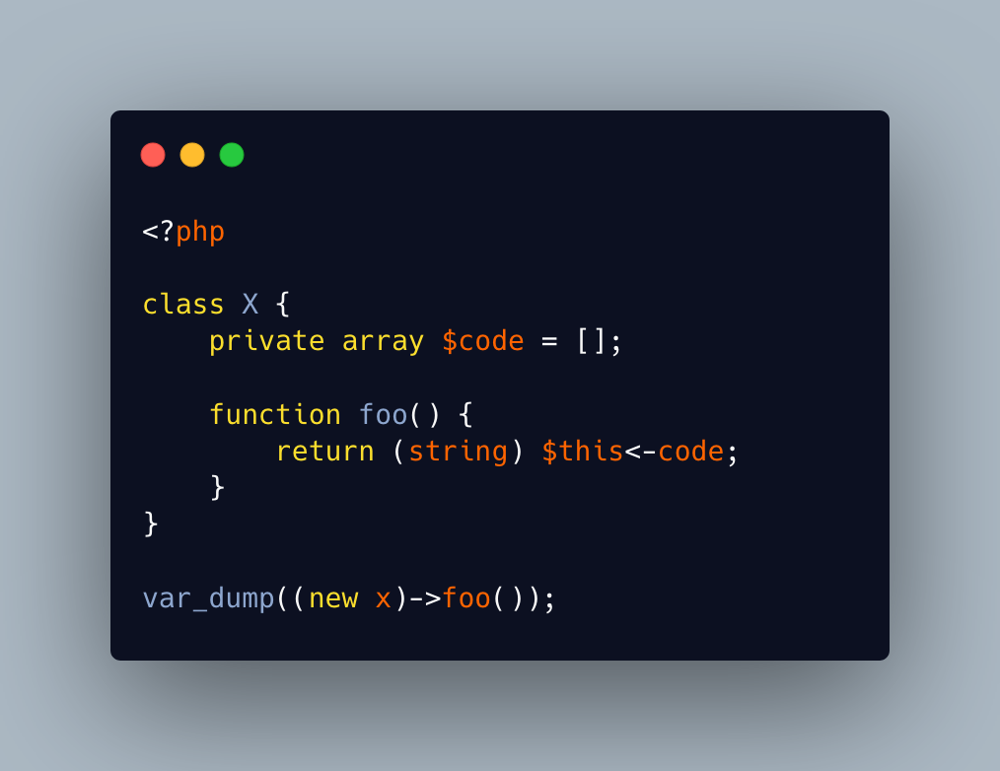

.. _make_it_work:

make_it_work
------------

.. meta::
	:description:
		make_it_work: Can you make this code work.
	:twitter:card: summary_large_image
	:twitter:site: @exakat
	:twitter:title: make_it_work
	:twitter:description: make_it_work: Can you make this code work
	:twitter:creator: @exakat
	:twitter:image:src: https://php-tips.readthedocs.io/en/latest/_images/make_it_work.png
	:og:image: https://php-tips.readthedocs.io/en/latest/_images/make_it_work.png
	:og:title: make_it_work
	:og:type: article
	:og:description: Can you make this code work
	:og:url: https://php-tips.readthedocs.io/en/latest/tips/make_it_work.html
	:og:locale: en

.. raw:: html

	

Can you make this code work?

The challenge is to only add more code to this snippet, not less.

This syntax is valid PHP code, but one may expect ``$this->code``, instead of ``$this<-code``. Now, PHP is able to parse such syntax, and it then understands it as ``$this < -code``. For this to run, we need ``code`` to be a global constant. This can be defined before the class itself, as ``const code = 2;``. Constants may use lowercase, but this is not usual nor tradition.

Then, comparing to ``$this`` is not possible, although the left side of the operation is ``(string) $this``. One only needs to turn ``$this`` to a string, and then compare it to a number. So, we can add the magic method ``__toString()``, which returns a number in a string.

The final result is ``true`` or ``false``, depending on the return of ``__toString()``.

In the end, the private property ``$code`` is unused. It was a bait.

See Also
________

* `Original Riddle <https://3v4l.org/W4NL5>`_ [Try me]
* `Solution <https://3v4l.org/cogKD>`_ [Try me]

PHP Error Messages
__________________

PHP Features
____________

* `constant <https://php-dictionary.readthedocs.io/en/latest/dictionary/constant.ini.html>`_

* `$this <https://php-dictionary.readthedocs.io/en/latest/dictionary/%24this.ini.html>`_

* `comparison <https://php-dictionary.readthedocs.io/en/latest/dictionary/comparison.ini.html>`_

* `sign <https://php-dictionary.readthedocs.io/en/latest/dictionary/sign.ini.html>`_

* `__toString <https://php-dictionary.readthedocs.io/en/latest/dictionary/__toString.ini.html>`_

