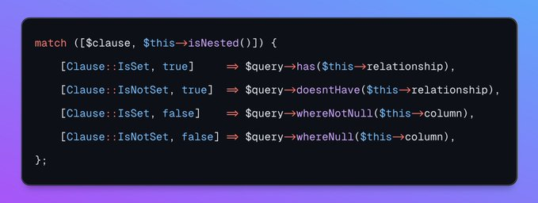

.. _match()-with-multiple-values:

Match() With Multiple Values
----------------------------

.. meta::
	:description:
		Match() With Multiple Values: This is an example of using ``match()``, to match against two values at the same time.
	:twitter:card: summary_large_image
	:twitter:site: @exakat
	:twitter:title: Match() With Multiple Values
	:twitter:description: Match() With Multiple Values: This is an example of using ``match()``, to match against two values at the same time
	:twitter:creator: @exakat
	:twitter:image:src: https://php-tips.readthedocs.io/en/latest/_images/match_multiple_values.png
	:og:image: https://php-tips.readthedocs.io/en/latest/_images/match_multiple_values.png
	:og:title: Match() With Multiple Values
	:og:type: article
	:og:description: This is an example of using ``match()``, to match against two values at the same time
	:og:url: https://php-tips.readthedocs.io/en/latest/tips/match_multiple_values.html
	:og:locale: en

.. raw:: html

	

By `Pascal Baljet <https://x.com/pascalbaljet>`_

This is an example of using ``match()``, to match against two values at the same time. The trick is to collect the two, or more, values in an array, and then return an array with the same number of elements in the same order.

It would also be possible to make a ``match(true)``, and use boolean expressions for each arm of the ``match()``. The first one that match is used.

See Also
________

* `Match (PHP manual) <https://www.php.net/manual/en/control-structures.match.php>`_
* `PHP Tricks: Multi-value match() <https://peakd.com/hive-168588/@crell/php-tricks-multi-value-match>`_
* `match multiple values <https://3v4l.org/2UQWu>`_ [Try me]

PHP Features
____________

* `match <https://php-dictionary.readthedocs.io/en/latest/dictionary/match.ini.html>`_

* `comparison <https://php-dictionary.readthedocs.io/en/latest/dictionary/comparison.ini.html>`_

