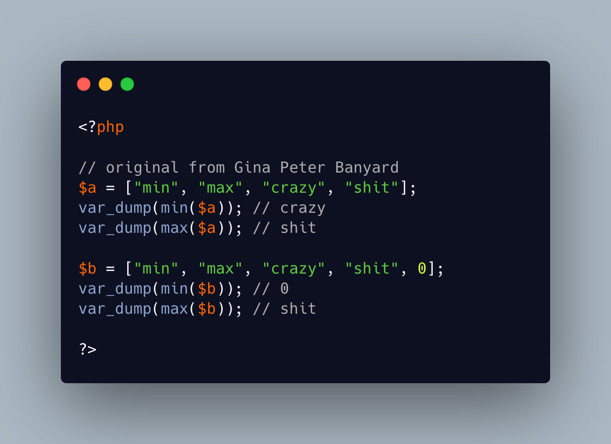

.. _max-on-strings:

max() On Strings
----------------

.. meta::
	:description:
		max() On Strings: The min() and max() functions return the minimum or the maximum value of items in an array.
	:twitter:card: summary_large_image
	:twitter:site: @exakat
	:twitter:title: max() On Strings
	:twitter:description: max() On Strings: The min() and max() functions return the minimum or the maximum value of items in an array
	:twitter:creator: @exakat
	:twitter:image:src: https://php-tips.readthedocs.io/en/latest/_images/max_on_string.png
	:og:image: https://php-tips.readthedocs.io/en/latest/_images/max_on_string.png
	:og:title: max() On Strings
	:og:type: article
	:og:description: The min() and max() functions return the minimum or the maximum value of items in an array
	:og:url: https://php-tips.readthedocs.io/en/latest/tips/max_on_string.html
	:og:locale: en

.. raw:: html

	

The min() and max() functions return the minimum or the maximum value of items in an array. This works on integers, but it also works on strings.

In the case of string, the comparison is made with the spaceship operator, so the letters are processed in alphabetical order.

The comparison is case-sensitive: upper-case letter have precedence over lower-case letter. That is usually the expected behavior.

Outside the alphabet range, the order of the strings is based on the ascii number of the characters in the string: then, digits are ranking lower than letters and will always appear first. And then, all even lower-ascii characters, such as ``%``, will appear first. This also means that it is recommended to ``trim()`` the strings to avoid getting strings with a leading space first as minium.

It also means that multi-bytes characters are sorted by ascii code of their bytes, not as a whole. Languages, like Chinese, usually do not sort text, so this feature may not be used anyway.

See Also
________

* `min-max on strings <https://3v4l.org/CkVhSL#v8.5.6>`_ [Try me]

PHP Features
____________

* `sort <https://php-dictionary.readthedocs.io/en/latest/dictionary/sort.ini.html>`_

* `spaceship <https://php-dictionary.readthedocs.io/en/latest/dictionary/spaceship.ini.html>`_

* `ascii <https://php-dictionary.readthedocs.io/en/latest/dictionary/ascii.ini.html>`_

* `multi-byte <https://php-dictionary.readthedocs.io/en/latest/dictionary/multi-byte.ini.html>`_

