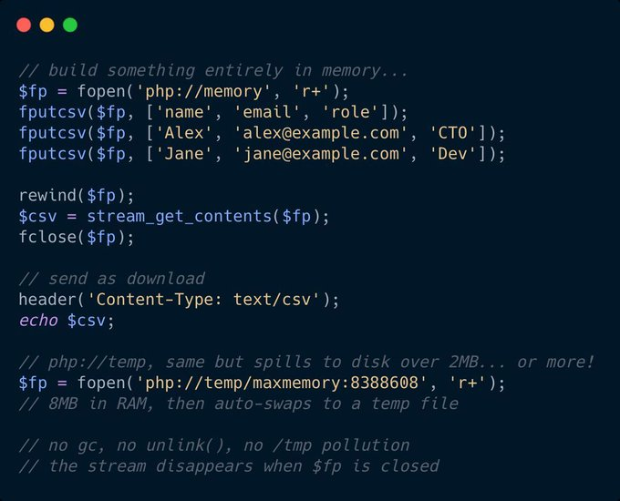

.. _php://memory-and-maxmemory:

php://memory And Maxmemory
--------------------------

.. meta::
	:description:
		php://memory And Maxmemory: php://memory is a stream that lives in RAM.
	:twitter:card: summary_large_image
	:twitter:site: @exakat
	:twitter:title: php://memory And Maxmemory
	:twitter:description: php://memory And Maxmemory: php://memory is a stream that lives in RAM
	:twitter:creator: @exakat
	:twitter:image:src: https://php-tips.readthedocs.io/en/latest/_images/maxmemory.png
	:og:image: https://php-tips.readthedocs.io/en/latest/_images/maxmemory.png
	:og:title: php://memory And Maxmemory
	:og:type: article
	:og:description: php://memory is a stream that lives in RAM
	:og:url: https://php-tips.readthedocs.io/en/latest/tips/maxmemory.html
	:og:locale: en

.. raw:: html

	

By `Alexandre Daubois <https://x.com/alexdaubois>`_

php://memory is a stream that lives in RAM.

php://temp starts in RAM, spills to disk after 2MB (configurable, see below!).

No tmpfile(). No temp directory. No cleanup.

Perfect for building files in memory before sending in PHP!

Did you know the ``maxmemory: `` trick?

See Also
________

* `Original Tweet <https://x.com/alexdaubois/status/2030555879720821023>`_
* `tmpfile <https://www.php.net/tmpfile>`_
* `PHP wrapper <https://www.php.net/manual/en/wrappers.php.php>`_
* `maxmemory and php:// wrapper <https://3v4l.org/UFBcn>`_ [Try me]

PHP Features
____________

* `wrapper <https://php-dictionary.readthedocs.io/en/latest/dictionary/wrapper.ini.html>`_

* `stream <https://php-dictionary.readthedocs.io/en/latest/dictionary/stream.ini.html>`_

