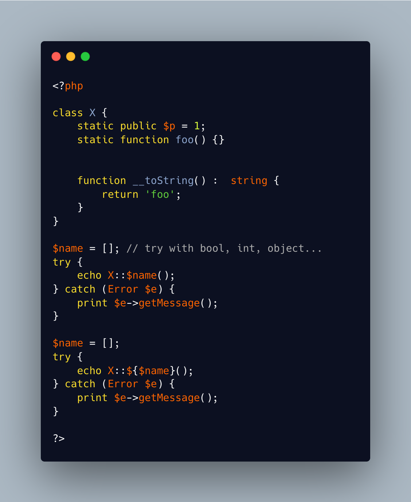

.. _method-not-property-name-must-be-string:

Method Not Property Name Must Be String
---------------------------------------

.. meta::
	:description:
		Method Not Property Name Must Be String: A dynamic property name must be a string, and it must exist.
	:twitter:card: summary_large_image
	:twitter:site: @exakat
	:twitter:title: Method Not Property Name Must Be String
	:twitter:description: Method Not Property Name Must Be String: A dynamic property name must be a string, and it must exist
	:twitter:creator: @exakat
	:twitter:image:src: https://php-tips.readthedocs.io/en/latest/_images/method_not_property_name_must_be_string.png
	:og:image: https://php-tips.readthedocs.io/en/latest/_images/method_not_property_name_must_be_string.png
	:og:title: Method Not Property Name Must Be String
	:og:type: article
	:og:description: A dynamic property name must be a string, and it must exist
	:og:url: https://php-tips.readthedocs.io/en/latest/tips/method_not_property_name_must_be_string.html
	:og:locale: en

.. raw:: html

	

A dynamic property name must be a string, and it must exist. It cannot be anything else, as not casting to string happens.

On the other hand, a dynamic property name is forcefully cast to a string before accessing its value.

See Also
________

* `Method Not Property Name Must Be String <https://3v4l.org/aKlmO>`_ [Try me]

PHP Features
____________

* `dynamic <https://php-dictionary.readthedocs.io/en/latest/dictionary/dynamic.ini.html>`_

* `dynamic-call <https://php-dictionary.readthedocs.io/en/latest/dictionary/dynamic-call.ini.html>`_

* `dynamic-property <https://php-dictionary.readthedocs.io/en/latest/dictionary/dynamic-property.ini.html>`_

