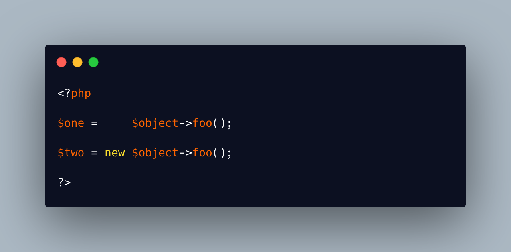

.. _method-or-property?:

Method Or Property?
-------------------

.. meta::
	:description:
		Method Or Property?: The first line is a simple call to the method ``foo``, on an object whose class is not show here: if this works, there is a method foo() in that class.
	:twitter:card: summary_large_image
	:twitter:site: @exakat
	:twitter:title: Method Or Property?
	:twitter:description: Method Or Property?: The first line is a simple call to the method ``foo``, on an object whose class is not show here: if this works, there is a method foo() in that class
	:twitter:creator: @exakat
	:twitter:image:src: https://php-tips.readthedocs.io/en/latest/_images/method_or_property.png
	:og:image: https://php-tips.readthedocs.io/en/latest/_images/method_or_property.png
	:og:title: Method Or Property?
	:og:type: article
	:og:description: The first line is a simple call to the method ``foo``, on an object whose class is not show here: if this works, there is a method foo() in that class
	:og:url: https://php-tips.readthedocs.io/en/latest/tips/method_or_property.html
	:og:locale: en

.. raw:: html

	

The first line is a simple call to the method ``foo``, on an object whose class is not show here: if this works, there is a method foo() in that class.

The second line is a simple call to the property ``foo``, on an object whose class is not know (again): it has a property called ``foo``. Then, the result of that property, hopefully a string with a class name, or another object, is instantiated, without any arguments.

The nuance is subtle.

* `method or property? <https://3v4l.org/b8rEC>`_

