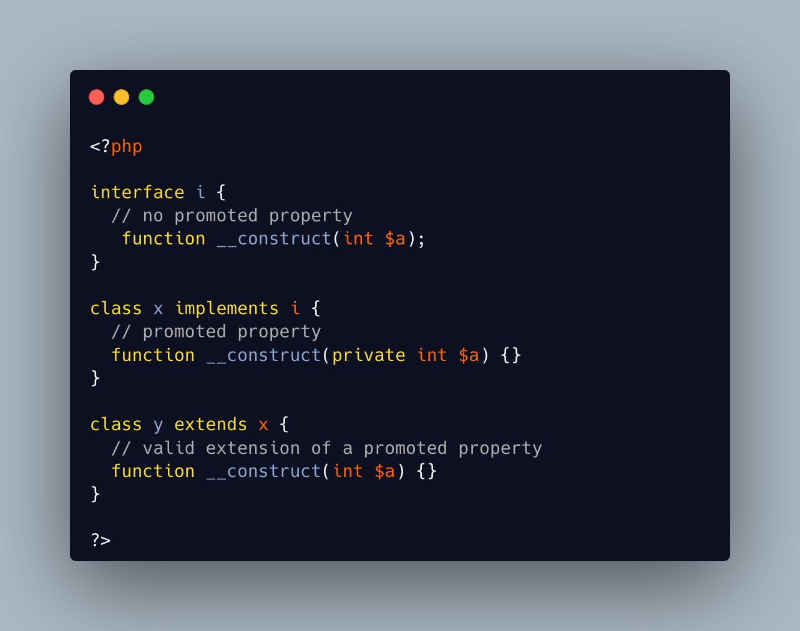

.. _reading-micro-seconds:

Reading Micro-seconds
---------------------

.. meta::
	:description:
		Reading Micro-seconds: There are different ways to access micro seconds in PHP : use the Datetime format of ``u``, which works with Datetime.
	:twitter:card: summary_large_image
	:twitter:site: @exakat
	:twitter:title: Reading Micro-seconds
	:twitter:description: Reading Micro-seconds: There are different ways to access micro seconds in PHP : use the Datetime format of ``u``, which works with Datetime
	:twitter:creator: @exakat
	:twitter:image:src: https://php-tips.readthedocs.io/en/latest/_images/microtimes.png
	:og:image: https://php-tips.readthedocs.io/en/latest/_images/microtimes.png
	:og:title: Reading Micro-seconds
	:og:type: article
	:og:description: There are different ways to access micro seconds in PHP : use the Datetime format of ``u``, which works with Datetime
	:og:url: https://php-tips.readthedocs.io/en/latest/tips/microtimes.html
	:og:locale: en

.. raw:: html

	

There are different ways to access micro seconds in PHP : use the Datetime format of ``u``, which works with Datetime. Or call the microtime() function, with the true parameter.

But don't use date(): although it has the same ``u`` formating letter, it never provides it.

* `microtime() (PHP manual) <https://www.php.net/microtime>`_
* `date() (PHP manual) <https://www.php.net/date>`_
* `Datetime (PHP manual) <https://www.php.net/manual/en/class.datetime.php>`_

