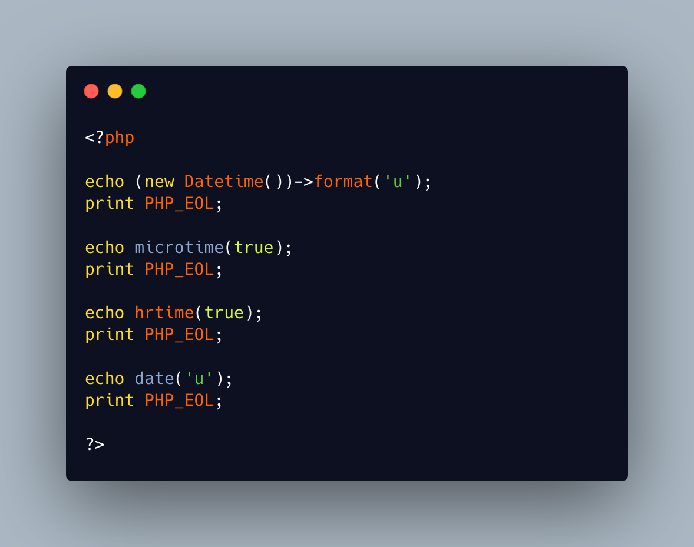

.. _reading-micro-seconds:

Reading Micro-seconds
---------------------

.. meta::
	:description:
		Reading Micro-seconds: There are different ways to access micro seconds in PHP : use the Datetime format of ``u``, which works with Datetime.

There are different ways to access micro seconds in PHP : use the Datetime format of ``u``, which works with Datetime. Or call the microtime() function, with the true parameter.

But don't use date(): although it has the same ``u`` formating letter, it never provides it.

* `microtime() (PHP manual) <https://www.php.net/microtime>`_
* `date() (PHP manual) <https://www.php.net/date>`_
* `Datetime (PHP manual) <https://www.php.net/manual/en/class.datetime.php>`_

