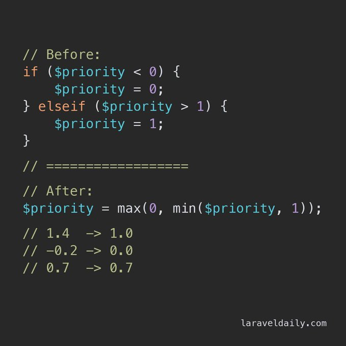

.. _min-and-max-for-interval:

min() And max() For Interval
----------------------------

.. meta::
	:description:
		min() And max() For Interval: PHP trick: min-max a number in one line.
	:twitter:card: summary_large_image
	:twitter:site: @exakat
	:twitter:title: min() And max() For Interval
	:twitter:description: min() And max() For Interval: PHP trick: min-max a number in one line
	:twitter:creator: @exakat
	:twitter:image:src: https://php-tips.readthedocs.io/en/latest/_images/min-max.png
	:og:image: https://php-tips.readthedocs.io/en/latest/_images/min-max.png
	:og:title: min() And max() For Interval
	:og:type: article
	:og:description: PHP trick: min-max a number in one line
	:og:url: https://php-tips.readthedocs.io/en/latest/tips/min-max.html
	:og:locale: en

.. raw:: html

	

By `Povilas Korop <https://www.youtube.com/c/LaravelDaily>`_

PHP trick: min-max a number in one line.

Need a value inside a range between 0 and 1?

Just nest ``min()`` and ``max()``: ``max(0, min($value, 1))``.

It pins all below 0 up to 0 and all above 1 down to 1.

Of course, if-else statement may look more readable, if you prefer :)

Addendum: future PHP 8.6 will have clamp() function for that purpose.

Addendum 2: min and max may be swapped, along with their literal, with the same effect.

Addendum 3: it also works on strings.

See Also
________

* `min-max swapped <https://3v4l.org/FM5ZC#v8.5.7>`_ [Try me]
* `min-max <https://3v4l.org/shWEL#v8.5.7>`_ [Try me]
* `min-max with strings <https://3v4l.org/HHLkD#v8.5.7>`_ [Try me]

PHP Features
____________

* `if-then <https://php-dictionary.readthedocs.io/en/latest/dictionary/if-then.ini.html>`_

* `integer <https://php-dictionary.readthedocs.io/en/latest/dictionary/integer.ini.html>`_

