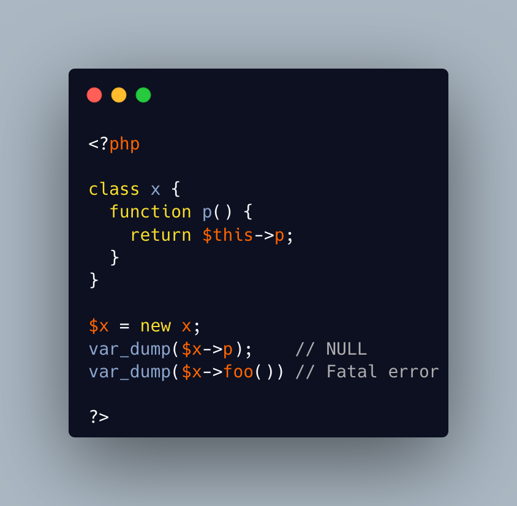

.. _missing-methods-are-fatal:

Missing Methods Are Fatal
-------------------------

.. meta::
	:description:
		Missing Methods Are Fatal: Calling a missing method is a fatal error.
	:twitter:card: summary_large_image.
	:twitter:site: @exakat.
	:twitter:title: Missing Methods Are Fatal.
	:twitter:description: Missing Methods Are Fatal: Calling a missing method is a fatal error.
	:twitter:creator: @exakat.
	:twitter:image:src: https://php-tips.readthedocs.io/en/latest/_images/missing_methods_are_fatal.png.png.
	:og:image: https://php-tips.readthedocs.io/en/latest/_images/missing_methods_are_fatal.png.png.
	:og:image: Missing Methods Are Fatal: Calling a missing method is a fatal error.

Calling a missing method is a fatal error. Reading a missing property is a warning and a default to NULL. Writing a missing property is deprecated in PHP 8.3, and will become a fatal error in PHP 9.0.

* `Properties (PHP manual) <https://www.php.net/manual/en/language.oop5.properties.php>`_

