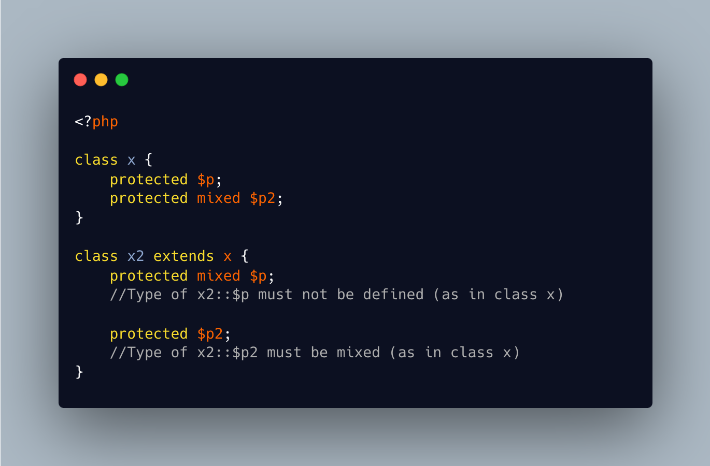

.. _mixed-and-untyped-are-not-compatible-types:

Mixed And Untyped Are Not Compatible Types
------------------------------------------

	.. meta::
		:description lang=en:
			Mixed And Untyped Are Not Compatible Types: A property typed mixed cannot be redefined later as untyped.

A property typed mixed cannot be redefined later as untyped. 

A property untyped cannot be redefined later as mixed. 

Although, both syntax represent the same reality: any type goes. 

Same for return type, in method compatibility situations. Although, it happens only when the parent is mixed, and the child untyped. 

With return type, PHP does check if anything is returned with a type of ``mixed``, and not if it is untyped.

* `Mixed (PHP manual) <https://www.php.net/manual/en/language.types.mixed.php>`_

