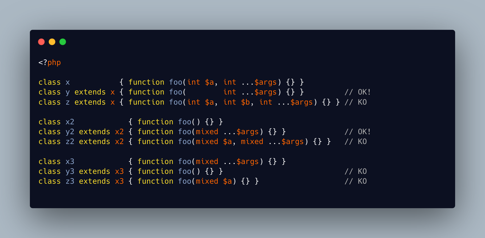

.. _mixed-compatibility:

Mixed Compatibility
-------------------

.. meta::
	:description:
		Mixed Compatibility: Method compatibility means that eponymous methods must have the same number of arguments, and compatible types.
	:twitter:card: summary_large_image
	:twitter:site: @exakat
	:twitter:title: Mixed Compatibility
	:twitter:description: Mixed Compatibility: Method compatibility means that eponymous methods must have the same number of arguments, and compatible types
	:twitter:creator: @exakat
	:twitter:image:src: https://php-tips.readthedocs.io/en/latest/_images/mixed_compatibility.png
	:og:image: https://php-tips.readthedocs.io/en/latest/_images/mixed_compatibility.png
	:og:title: Mixed Compatibility
	:og:type: article
	:og:description: Method compatibility means that eponymous methods must have the same number of arguments, and compatible types
	:og:url: https://php-tips.readthedocs.io/en/latest/tips/mixed_compatibility.html
	:og:locale: en

.. raw:: html

	

Method compatibility means that eponymous methods must have the same number of arguments, and compatible types.

One special case is using variadic: with it, it is allowed to remove arguments, as long as they are the same type, and next to the variadic.

With mixed variadic, it is also possible to go from no arguments to one argument. The opposite is not possible: one cannot drop a ``mixed ...$args`` once it was added.

See Also
________

* `mixed variadic magic <https://3v4l.org/6kQRu>`_ [Try me]

PHP Error Messages
__________________

* `Declaration of y4::foo($b, $c, $d) must be compatible with x4::foo($a, $b) <https://php-errors.readthedocs.io/en/latest/messages/declaration-of-%25s%3A%3A%25s%28%29-must-be-compatible-with-%25s%3A%3A%25s%28%29.html>`_

PHP Features
____________

* `method-compatibility <https://php-dictionary.readthedocs.io/en/latest/dictionary/method-compatibility.ini.html>`_

* `variadic <https://php-dictionary.readthedocs.io/en/latest/dictionary/variadic.ini.html>`_

* `mixed <https://php-dictionary.readthedocs.io/en/latest/dictionary/mixed.ini.html>`_

