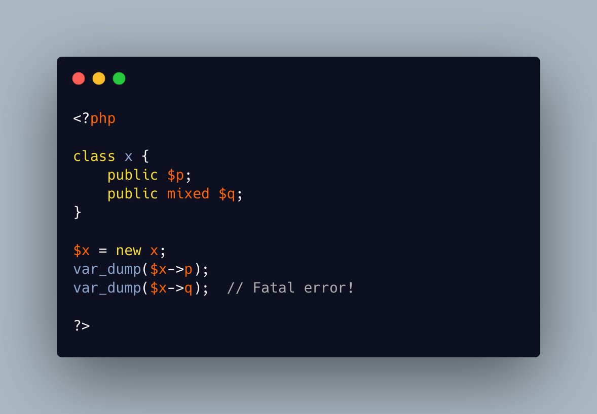

.. _mixed-is-not-no-type:

mixed Is Not No Type
--------------------

.. meta::
	:description:
		mixed Is Not No Type: When a property is not typed, nor has a default value, it still may be accessed freely: its value is ``null``.
	:twitter:card: summary_large_image
	:twitter:site: @exakat
	:twitter:title: mixed Is Not No Type
	:twitter:description: mixed Is Not No Type: When a property is not typed, nor has a default value, it still may be accessed freely: its value is ``null``
	:twitter:creator: @exakat
	:twitter:image:src: https://php-tips.readthedocs.io/en/latest/_images/mixed_is_not_no_type.png
	:og:image: https://php-tips.readthedocs.io/en/latest/_images/mixed_is_not_no_type.png
	:og:title: mixed Is Not No Type
	:og:type: article
	:og:description: When a property is not typed, nor has a default value, it still may be accessed freely: its value is ``null``
	:og:url: https://php-tips.readthedocs.io/en/latest/tips/mixed_is_not_no_type.html
	:og:locale: en

.. raw:: html

	

When a property is not typed, nor has a default value, it still may be accessed freely: its value is ``null``. On the other hand, a ``mixed`` typed property may also hold anything, but it cannot be accessed until it was written once.

On development, it might be a good strategy to type properties ``mixed`` to spot any uninitialized usage and set them.

See Also
________

* `mixed (PHP manual) <https://www.php.net/manual/en/language.types.mixed.php>`_
* `mixed is not absence of type <https://3v4l.org/itGW9>`_ [Try me]

PHP Error Messages
__________________

* `Typed property %s::$%s must not be accessed before initialization <https://php-errors.readthedocs.io/en/latest/messages/typed-property-%25s%3A%3A%24%25s-must-not-be-accessed-before-initialization.html>`_

