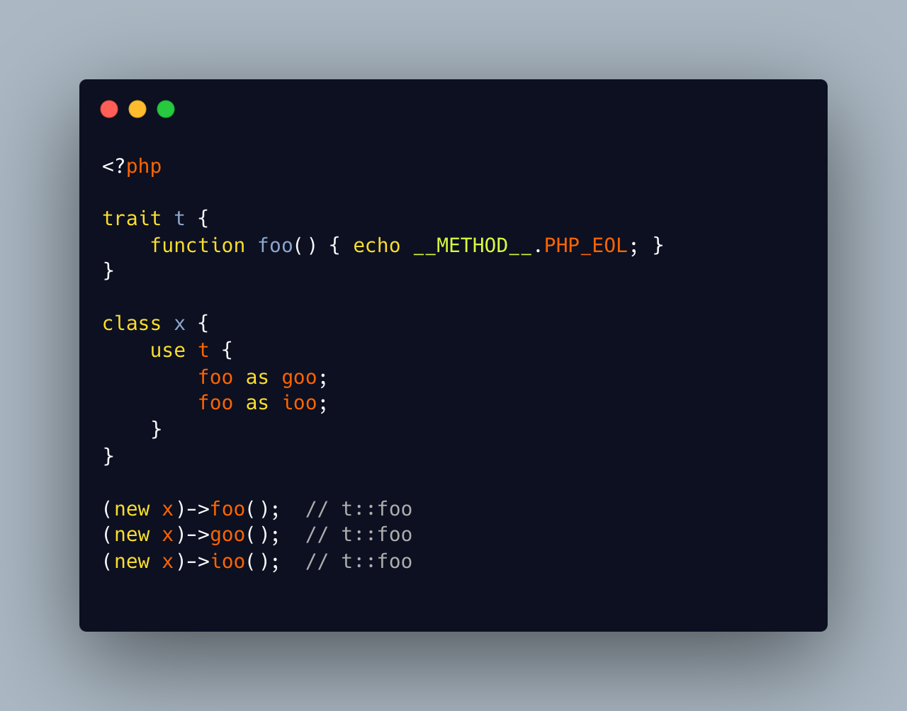

.. _multiple-aliases:

Multiple Aliases
----------------

.. meta::
	:description:
		Multiple Aliases: It is possible to rename an imported method from a trait, by using an alias name.
	:twitter:card: summary_large_image
	:twitter:site: @exakat
	:twitter:title: Multiple Aliases
	:twitter:description: Multiple Aliases: It is possible to rename an imported method from a trait, by using an alias name
	:twitter:creator: @exakat
	:twitter:image:src: https://php-tips.readthedocs.io/en/latest/_images/multipleAliases.png
	:og:image: https://php-tips.readthedocs.io/en/latest/_images/multipleAliases.png
	:og:title: Multiple Aliases
	:og:type: article
	:og:description: It is possible to rename an imported method from a trait, by using an alias name
	:og:url: https://php-tips.readthedocs.io/en/latest/tips/multipleAliases.html
	:og:locale: en

It is possible to rename an imported method from a trait, by using an alias name. It is also possible to import it several times, with different names.

And, unlike static/self, it is not possible for the called method to know how it was called.

* `Traits <https://www.php.net/manual/en/language.oop5.traits.php>`_

