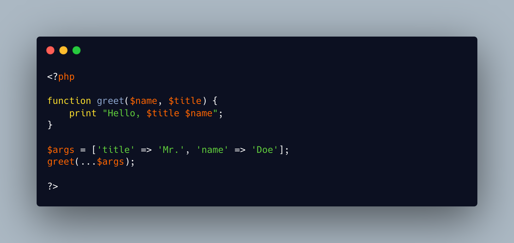

.. _named-parameter-in-an-array:

Named Parameter In An Array
---------------------------

.. meta::
	:description:
		Named Parameter In An Array: It is possible to spread the arguments from an array to a functioncall.
	:twitter:card: summary_large_image
	:twitter:site: @exakat
	:twitter:title: Named Parameter In An Array
	:twitter:description: Named Parameter In An Array: It is possible to spread the arguments from an array to a functioncall
	:twitter:creator: @exakat
	:twitter:image:src: https://php-tips.readthedocs.io/en/latest/_images/named_parameter_in_an_array.png
	:og:image: https://php-tips.readthedocs.io/en/latest/_images/named_parameter_in_an_array.png
	:og:title: Named Parameter In An Array
	:og:type: article
	:og:description: It is possible to spread the arguments from an array to a functioncall
	:og:url: https://php-tips.readthedocs.io/en/latest/tips/named_parameter_in_an_array.html
	:og:locale: en

.. raw:: html

	

It is possible to spread the arguments from an array to a functioncall. It is also possible to use the keys to name the arguments, and have them in any order in the array, just like named parameters.

It is possible since PHP 8.0, and was an unrelated error before.

See Also
________

* `Tips for arguments in array <https://x.com/laravelbackpack/status/1914642850970742973>`_
* `Named parameter in array <https://3v4l.org/pTq6T>`_ [Try me]

PHP Error Messages
__________________

* `Cannot unpack array with string keys <https://php-errors.readthedocs.io/en/latest/messages/cannot-unpack-array-with-string-keys.html>`_

PHP Features
____________

* `named-parameter <https://php-dictionary.readthedocs.io/en/latest/dictionary/named-parameter.ini.html>`_

* `ellipsis <https://php-dictionary.readthedocs.io/en/latest/dictionary/ellipsis.ini.html>`_

