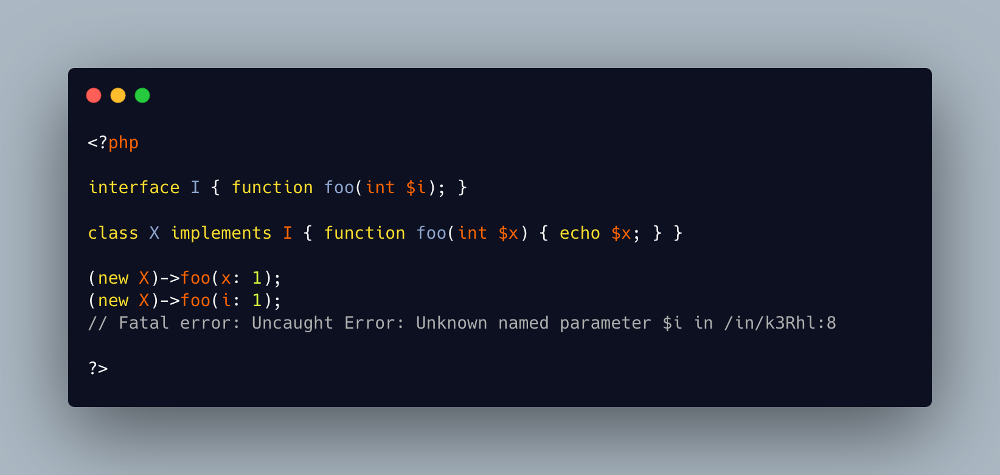

.. _named_parameter_inheritance:

named_parameter_inheritance
---------------------------

.. meta::
	:description:
		named_parameter_inheritance: PHP enforces the methods compatibility with their types, names, and various options, but not with the parameter names.
	:twitter:card: summary_large_image
	:twitter:site: @exakat
	:twitter:title: named_parameter_inheritance
	:twitter:description: named_parameter_inheritance: PHP enforces the methods compatibility with their types, names, and various options, but not with the parameter names
	:twitter:creator: @exakat
	:twitter:image:src: https://php-tips.readthedocs.io/en/latest/_images/named_parameter_inheritance.png
	:og:image: https://php-tips.readthedocs.io/en/latest/_images/named_parameter_inheritance.png
	:og:title: named_parameter_inheritance
	:og:type: article
	:og:description: PHP enforces the methods compatibility with their types, names, and various options, but not with the parameter names
	:og:url: https://php-tips.readthedocs.io/en/latest/tips/named_parameter_inheritance.html
	:og:locale: en

.. raw:: html

	

PHP enforces the methods compatibility with their types, names, and various options, but not with the parameter names. This means the parameter name existence is enforced, but the name might change. It might change between the parent and the child, but also, between the class and the interface. 

It is recommended to keep all these parameter's name identical, so as to keep consistence in the code, and simplify the usage of the method, with named parameters. 

* `Function parameters and arguments (PHP manual) <https://www.php.net/manual/en/functions.arguments.php>`_
* `named parameter changes <https://3v4l.org/k3Rhl>`_

