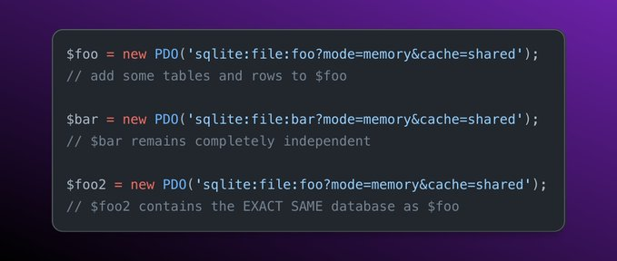

.. _named-sqlite3-in-memory:

Named Sqlite3 In Memory
-----------------------

.. meta::
	:description:
		Named Sqlite3 In Memory: Sqlite3 allows the creation of ``memory`` databases: the database is not stored on the disk, but in memory.
	:twitter:card: summary_large_image
	:twitter:site: @exakat
	:twitter:title: Named Sqlite3 In Memory
	:twitter:description: Named Sqlite3 In Memory: Sqlite3 allows the creation of ``memory`` databases: the database is not stored on the disk, but in memory
	:twitter:creator: @exakat
	:twitter:image:src: https://php-tips.readthedocs.io/en/latest/_images/named_sqlite3_in_memory.png
	:og:image: https://php-tips.readthedocs.io/en/latest/_images/named_sqlite3_in_memory.png
	:og:title: Named Sqlite3 In Memory
	:og:type: article
	:og:description: Sqlite3 allows the creation of ``memory`` databases: the database is not stored on the disk, but in memory
	:og:url: https://php-tips.readthedocs.io/en/latest/tips/named_sqlite3_in_memory.html
	:og:locale: en

By `archtechx <https://x.com/archtechx>`_

Sqlite3 allows the creation of ``memory`` databases: the database is not stored on the disk, but in memory. This is good for temporary data, that requires some SQL features.

Then, by default, every instantiation of a Sqlite3 memory database provides the same database. Then, when using the command ``sqlite:file:foo:?mode=memory&cache=shared``, the memory database gets a name, and it is now possible to have distinct sqlite3 instances.

* `Original Tweet <https://x.com/archtechx/status/1863623958739796116>`_
* `SQLite3::__construct <https://www.php.net/manual/en/sqlite3.construct.php>`_
* `PDO Sqlite3 DSN <https://www.php.net/manual/en/ref.pdo-sqlite.connection.php>`_

