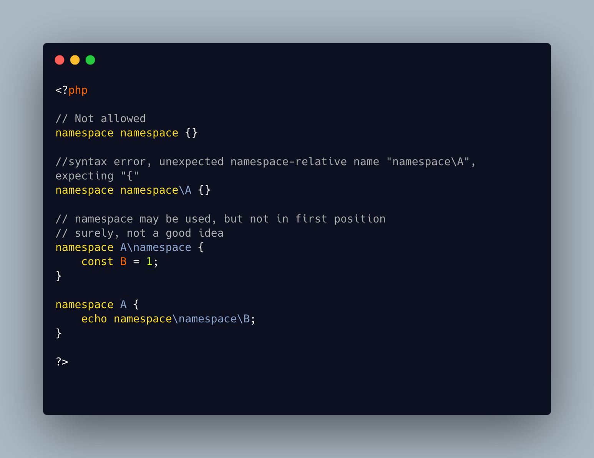

.. _namespace,-but-far-in-the-name:

namespace, But Far In The Name
------------------------------

.. meta::
	:description:
		namespace, But Far In The Name: Namespaces can be named anything, except ``namespace``.
	:twitter:card: summary_large_image
	:twitter:site: @exakat
	:twitter:title: namespace, But Far In The Name
	:twitter:description: namespace, But Far In The Name: Namespaces can be named anything, except ``namespace``
	:twitter:creator: @exakat
	:twitter:image:src: https://php-tips.readthedocs.io/en/latest/_images/namespace_but_far.png
	:og:image: https://php-tips.readthedocs.io/en/latest/_images/namespace_but_far.png
	:og:title: namespace, But Far In The Name
	:og:type: article
	:og:description: Namespaces can be named anything, except ``namespace``
	:og:url: https://php-tips.readthedocs.io/en/latest/tips/namespace_but_far.html
	:og:locale: en

.. raw:: html

	

Namespaces can be named anything, except ``namespace``. That keyword is used as a prefix, on a name (class, function, constant, etc.) to represent the current namespace, and allow for relative sub-namespaces.

Then, the ``namespace`` keyword cannot be used as the first part of a namespace, as it would conflict with the ``namespace`` relative part.

But it is possible to use ``namespace`` later in the name.

See Also
________

* `namespace (PHP manual) <https://www.php.net/manual/en/language.namespaces.nsconstants.php>`_
* `namespace in a namespace <https://3v4l.org/gQie5>`_

