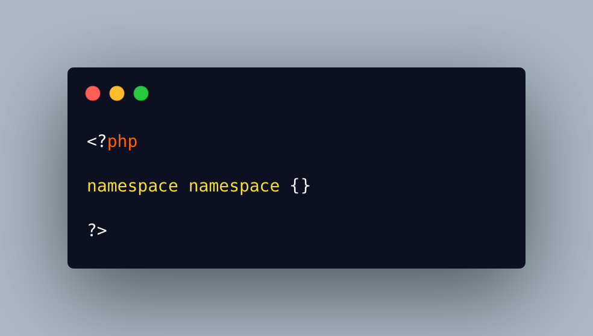

.. _namespace-namespace:

namespace namespace
-------------------

.. meta::
	:description:
		namespace namespace: The only forbidden name for a namespace is ``namespace``.
	:twitter:card: summary_large_image
	:twitter:site: @exakat
	:twitter:title: namespace namespace
	:twitter:description: namespace namespace: The only forbidden name for a namespace is ``namespace``
	:twitter:creator: @exakat
	:twitter:image:src: https://php-tips.readthedocs.io/en/latest/_images/namespace_namespace.png
	:og:image: https://php-tips.readthedocs.io/en/latest/_images/namespace_namespace.png
	:og:title: namespace namespace
	:og:type: article
	:og:description: The only forbidden name for a namespace is ``namespace``
	:og:url: https://php-tips.readthedocs.io/en/latest/tips/namespace_namespace.html
	:og:locale: en

.. raw:: html

	

The only forbidden name for a namespace is ``namespace``. Not only is it confusing, but also, that keyword is used later for prefixing names. The correct names follow the usual PHP regex, with a leading letter or underscore, followed by a list of alpha-numeric characters; unicode beyond 255 are also used.

See Also
________

* `namespace (PHP manual) <https://www.php.net/manual/en/language.namespaces.nsconstants.php>`_
* `namespace namespace <https://3v4l.org/8TdKi>`_

