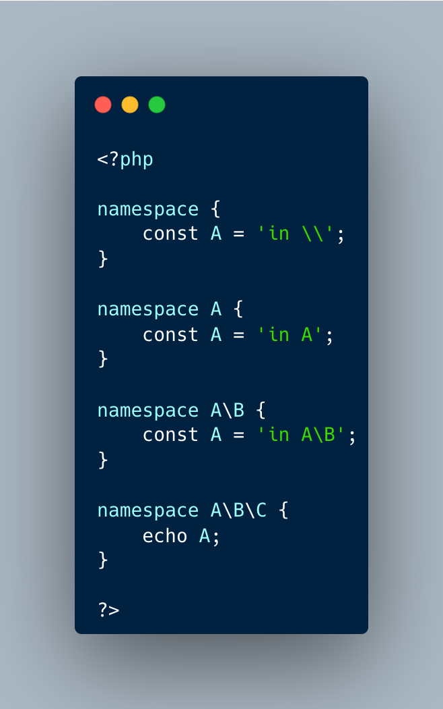

.. _the-namespace-stack:

The Namespace Stack
-------------------

.. meta::
	:description:
		The Namespace Stack: Reminder that namespaces are not stacked, but are merely prefixes.
	:twitter:card: summary_large_image
	:twitter:site: @exakat
	:twitter:title: The Namespace Stack
	:twitter:description: The Namespace Stack: Reminder that namespaces are not stacked, but are merely prefixes
	:twitter:creator: @exakat
	:twitter:image:src: https://php-tips.readthedocs.io/en/latest/_images/namespace_stack.png
	:og:image: https://php-tips.readthedocs.io/en/latest/_images/namespace_stack.png
	:og:title: The Namespace Stack
	:og:type: article
	:og:description: Reminder that namespaces are not stacked, but are merely prefixes
	:og:url: https://php-tips.readthedocs.io/en/latest/tips/namespace_stack.html
	:og:locale: en

.. raw:: html

	

Reminder that namespaces are not stacked, but are merely prefixes. Hence, there is the current namespace, and the global one for the occasional fallback, but nothing in between. Namespaces are not folders, even when they are stored as such.

See Also
________

* `Namespace (PHP manual) <https://www.php.net/manual/en/language.namespaces.php>`_

