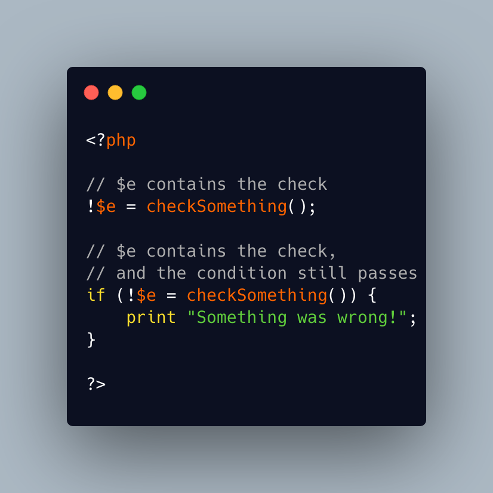

.. _negating-an-assignation:

Negating An Assignation
-----------------------

I always wondered why PHP allows to NOT a variable on the LEFT side of an assignation.

It makes sense with an iffectation (an assignation in an if)

I'm sure other such expressions are possible, with unary operators. 

Definitely not for me, for readability reasons; same as !$o instanceof X.

* `Operator precedence (PHP manual) <https://www.php.net/manual/en/language.operators.precedence.php>`_

