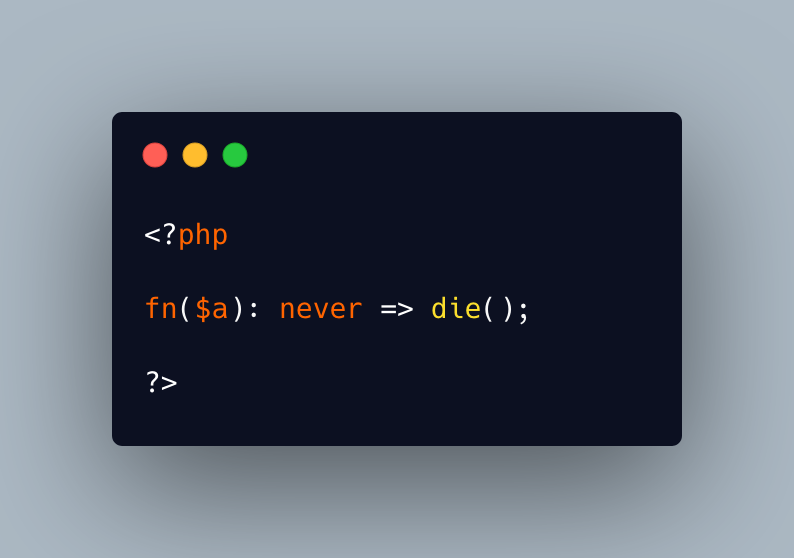

.. _the-never-function-arrow:

The Never Function Arrow
------------------------

.. meta::
	:description:
		The Never Function Arrow: This is a rare occurence: that syntax is not valid in PHP 8.
	:twitter:card: summary_large_image
	:twitter:site: @exakat
	:twitter:title: The Never Function Arrow
	:twitter:description: The Never Function Arrow: This is a rare occurence: that syntax is not valid in PHP 8
	:twitter:creator: @exakat
	:twitter:image:src: https://php-tips.readthedocs.io/en/latest/_images/neverFunctionArrow.png
	:og:image: https://php-tips.readthedocs.io/en/latest/_images/neverFunctionArrow.png
	:og:title: The Never Function Arrow
	:og:type: article
	:og:description: This is a rare occurence: that syntax is not valid in PHP 8
	:og:url: https://php-tips.readthedocs.io/en/latest/tips/neverFunctionArrow.html
	:og:locale: en

.. raw:: html

	

This is a rare occurence: that syntax is not valid in PHP 8.1, but valid before and after.

In PHP 7.4 and 8.0, the syntax is valid, because ``never`` was not a reserved type. PHP considered it as a class name, but since ``die`` would prevent any return, it is not actually used.

Starting PHP 8.2, PHP recognizes the absence of return, due to the ``die``, and accepts it.

Also, great edge case of a closure with a (implicit) return, but typed ``never``. Actually, it doesn't work with a regular ``return``.

See Also
________

* `never arrow function <https://3v4l.org/Kmq3Q>`_ [Try me]

PHP Error Messages
__________________

* `never-returning function must not implicitly return <https://php-errors.readthedocs.io/en/latest/messages/never-returning-function-must-not-implicitly-return.html>`_

PHP Features
____________

* `never <https://php-dictionary.readthedocs.io/en/latest/dictionary/never.ini.html>`_

* `arrow-function <https://php-dictionary.readthedocs.io/en/latest/dictionary/arrow-function.ini.html>`_

