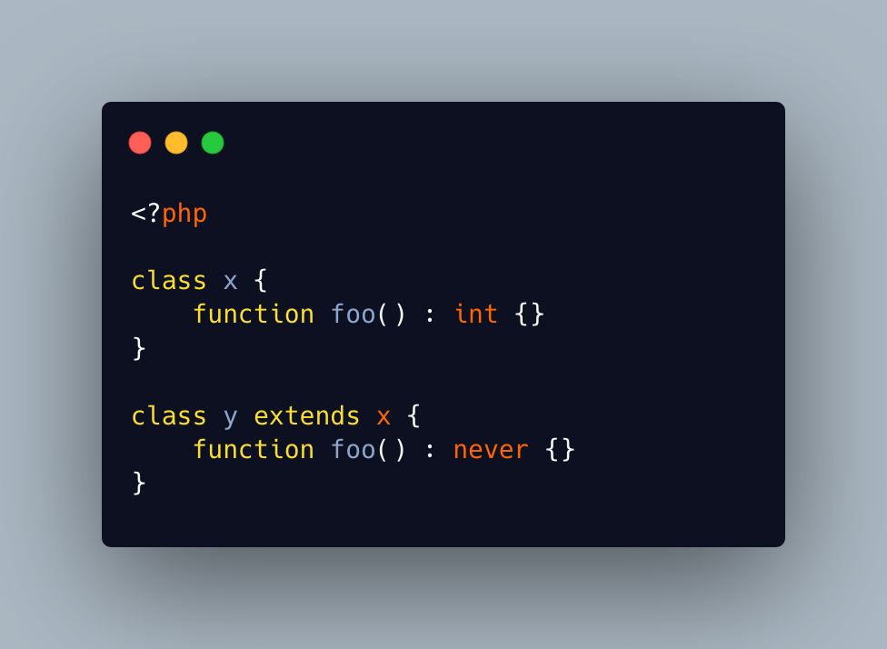

.. _never-is-the-lowest-ranking-type:

Never Is The Lowest Ranking Type
--------------------------------

.. meta::
	:description:
		Never Is The Lowest Ranking Type: It is always possible to use ``never`` as a compatible type in a return type.
	:twitter:card: summary_large_image
	:twitter:site: @exakat
	:twitter:title: Never Is The Lowest Ranking Type
	:twitter:description: Never Is The Lowest Ranking Type: It is always possible to use ``never`` as a compatible type in a return type
	:twitter:creator: @exakat
	:twitter:image:src: https://php-tips.readthedocs.io/en/latest/_images/neverIsAlwaysCovariant.png
	:og:image: https://php-tips.readthedocs.io/en/latest/_images/neverIsAlwaysCovariant.png
	:og:title: Never Is The Lowest Ranking Type
	:og:type: article
	:og:description: It is always possible to use ``never`` as a compatible type in a return type
	:og:url: https://php-tips.readthedocs.io/en/latest/tips/neverIsAlwaysCovariant.html
	:og:locale: en

.. raw:: html

	

It is always possible to use ``never`` as a compatible type in a return type. It is the lowest ranking type, and is compatible with anything else.

Of course, to finish implementing it, the method would also have to never return.

See Also
________

* `Always Compatible Returntype <https://3v4l.org/2YXVq6>`_ [Try me]

PHP Error Messages
__________________

* `Declaration of %s must be compatible with %s <https://php-errors.readthedocs.io/en/latest/messages/declaration-of-%25s-must-be-compatible-with-%25s.html>`_

PHP Features
____________

* `never <https://php-dictionary.readthedocs.io/en/latest/dictionary/never.ini.html>`_

* `type <https://php-dictionary.readthedocs.io/en/latest/dictionary/type.ini.html>`_

