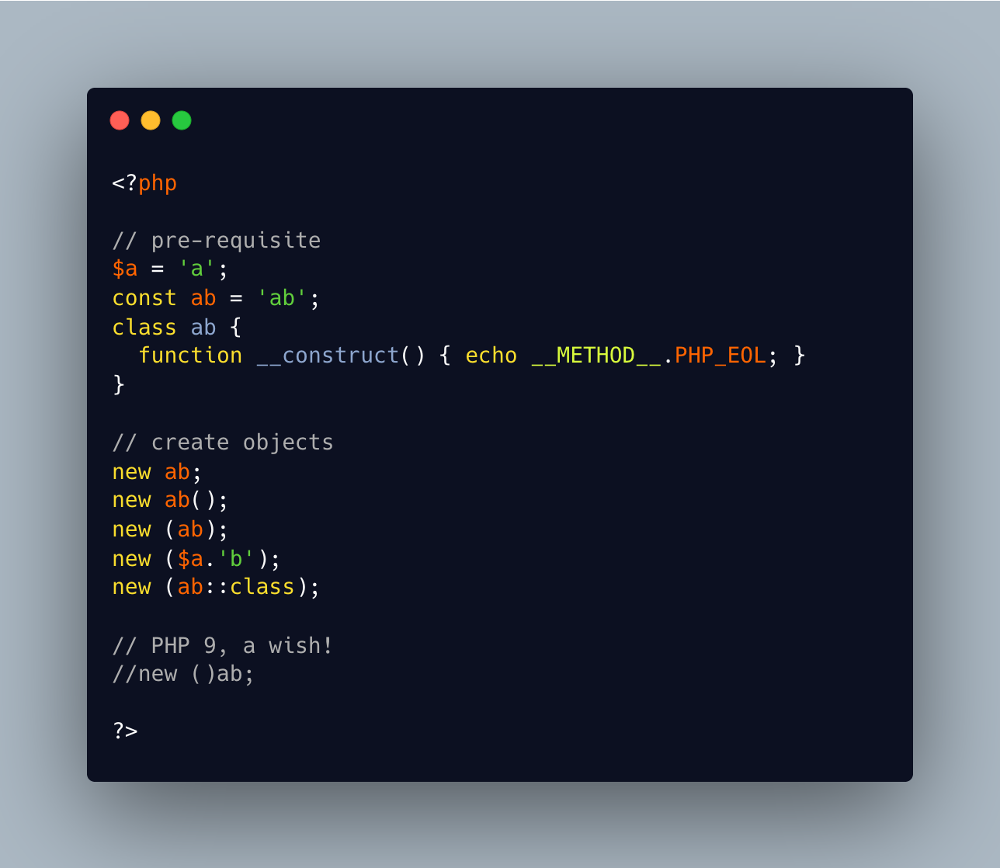

.. _the-new-and-the-parenthesis:

The New And The Parenthesis
---------------------------

.. meta::
	:description:
		The New And The Parenthesis: Where does PHP accept parenthesis in a ``new`` call.
	:twitter:card: summary_large_image
	:twitter:site: @exakat
	:twitter:title: The New And The Parenthesis
	:twitter:description: The New And The Parenthesis: Where does PHP accept parenthesis in a ``new`` call
	:twitter:creator: @exakat
	:twitter:image:src: https://php-tips.readthedocs.io/en/latest/_images/new_and_parenthesis.png
	:og:image: https://php-tips.readthedocs.io/en/latest/_images/new_and_parenthesis.png
	:og:title: The New And The Parenthesis
	:og:type: article
	:og:description: Where does PHP accept parenthesis in a ``new`` call
	:og:url: https://php-tips.readthedocs.io/en/latest/tips/new_and_parenthesis.html
	:og:locale: en

.. raw:: html

	

Where does PHP accept parenthesis in a ``new`` call?

First, no parenthesis is possible, as long as the constructor has no parameter.

Secondly, also, parenthesis are possible, after the class name.

Then, the parenthesis may be around the class name, as long as there is a constant which holds the name of the class. Bonus point for the class and the constant with the same name.

After that, there is a dynamic call, where the full name of the class is build, then used.

And the last one is the constant version, with an explicit ``::class`` operator.

Now, it would be great to have a syntax where the parenthesis are before the class name: no other language has that! So, for PHP 9, but more importantly: what for?

See Also
________

* `Basics (PHP manual) <https://www.php.net/manual/en/language.oop5.basic.php>`_
* `new and parenthesis <https://3v4l.org/K2ZrD>`_ [Try me]

