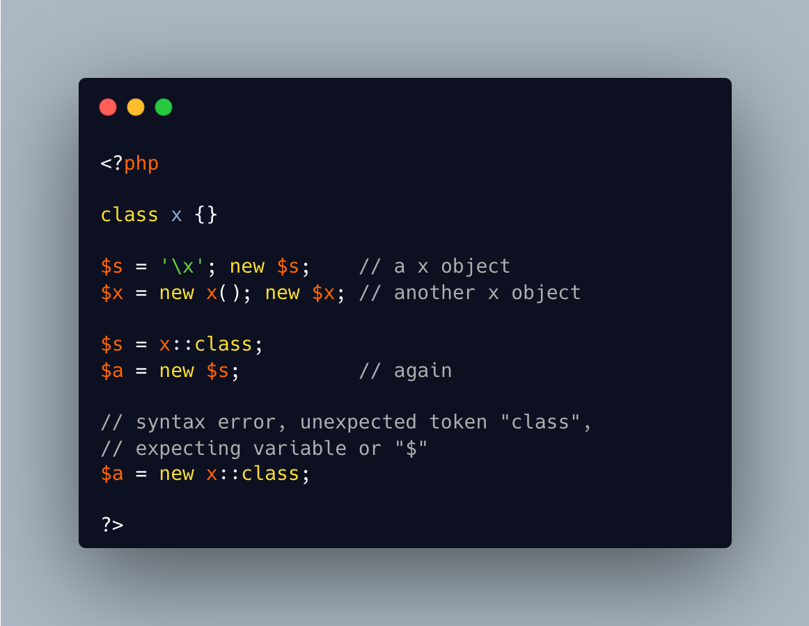

.. _new-on-object:

new On Object
-------------

	.. meta::
		:description lang=en:
			new On Object: It is possible to use new on an object, to get a new object of the same class.

By `Benoit Viguier <https://phpc.social/@b_viguier>`_

It is possible to use new on an object, to get a new object of the same class. This might be useful with anonymous classes, which cannot be created with their name.

    

When using the parenthesis after the variable, the __invoke() magic method won't be called, as those parenthesis are used to call the constructor. To get that result, it must be called outside the new command.

Under the hood, PHP collects the class name from the object to produce the new one. It is akin to using the class name in a string. 

Lastly, the full class name is available in the x::class syntax, but PHP won't recognize ``new x::class``, and even emit a Fatal error. 

    

