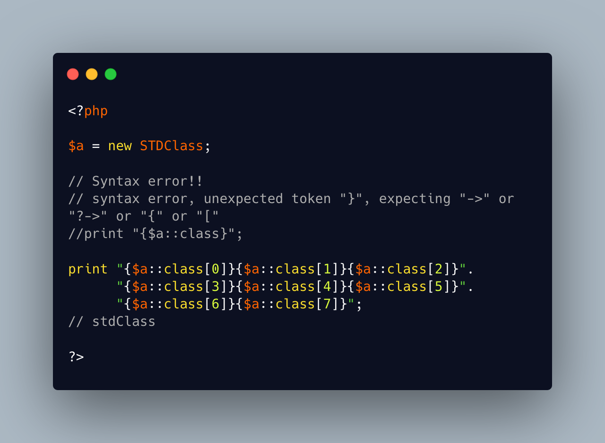

.. _no-class-constant-in-string:

No Class Constant In String
---------------------------

.. meta::
	:description:
		No Class Constant In String: Interpolation is injecting variable values inside strings.
	:twitter:card: summary_large_image
	:twitter:site: @exakat
	:twitter:title: No Class Constant In String
	:twitter:description: No Class Constant In String: Interpolation is injecting variable values inside strings
	:twitter:creator: @exakat
	:twitter:image:src: https://php-tips.readthedocs.io/en/latest/_images/no-constant-in-string.png.png
	:og:image: https://php-tips.readthedocs.io/en/latest/_images/no-constant-in-string.png
	:og:title: No Class Constant In String
	:og:type: article
	:og:description: Interpolation is injecting variable values inside strings
	:og:url: https://php-tips.readthedocs.io/en/latest/tips/no-constant-in-string.html
	:og:locale: en

Interpolation is injecting variable values inside strings. For complex variables, such as objects, it requires the curly braces to work.

Yet, the simple ``$object::CONSTANT`` doesn't compile. But, the error message mentions it could do something with a square bracket, so it is still possible to access the value of strings by using the array notation.

I wish there was a better way to inject that class name in the string, or, any class constant.

Also, note that the reported class name is the definition one, not the name that was used at instanciation.

So many suprises.

* `String interpolation (PHP manual) <https://www.php.net/manual/en/language.types.string.php#language.types.string.parsing>`_

