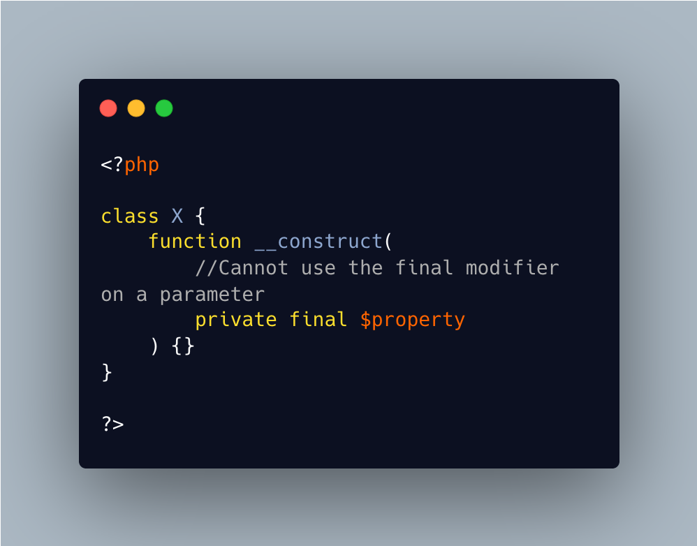

.. _no-final-parameter:

No Final Parameter
------------------

.. meta::
	:description:
		No Final Parameter: Final is reserved for class elements, such as property, methods and constants.
	:twitter:card: summary_large_image
	:twitter:site: @exakat
	:twitter:title: No Final Parameter
	:twitter:description: No Final Parameter: Final is reserved for class elements, such as property, methods and constants
	:twitter:creator: @exakat
	:twitter:image:src: https://php-tips.readthedocs.io/en/latest/_images/no-final-parameter.png
	:og:image: https://php-tips.readthedocs.io/en/latest/_images/no-final-parameter.png
	:og:title: No Final Parameter
	:og:type: article
	:og:description: Final is reserved for class elements, such as property, methods and constants
	:og:url: https://php-tips.readthedocs.io/en/latest/tips/no-final-parameter.html
	:og:locale: en

.. raw:: html

	

Final is reserved for class elements, such as property, methods and constants. They do not apply to a paramter, unless the parameter is a promoted property, in the constructor signature.

In that case, the property cannot be declared in the constructor, and must be declared independently, or without the final key word.

See Also
________

* `Final (PHP manual) <https://www.php.net/manual/en/language.oop5.final.php>`_
* `Final On A Parameter <https://3v4l.org/HKsFL>`_

PHP Error Messages
__________________

* `Cannot use the %s modifier on a %s <https://php-errors.readthedocs.io/en/latest/messages/cannot-use-the-%25s-modifier-on-a-%25s.html>`_

