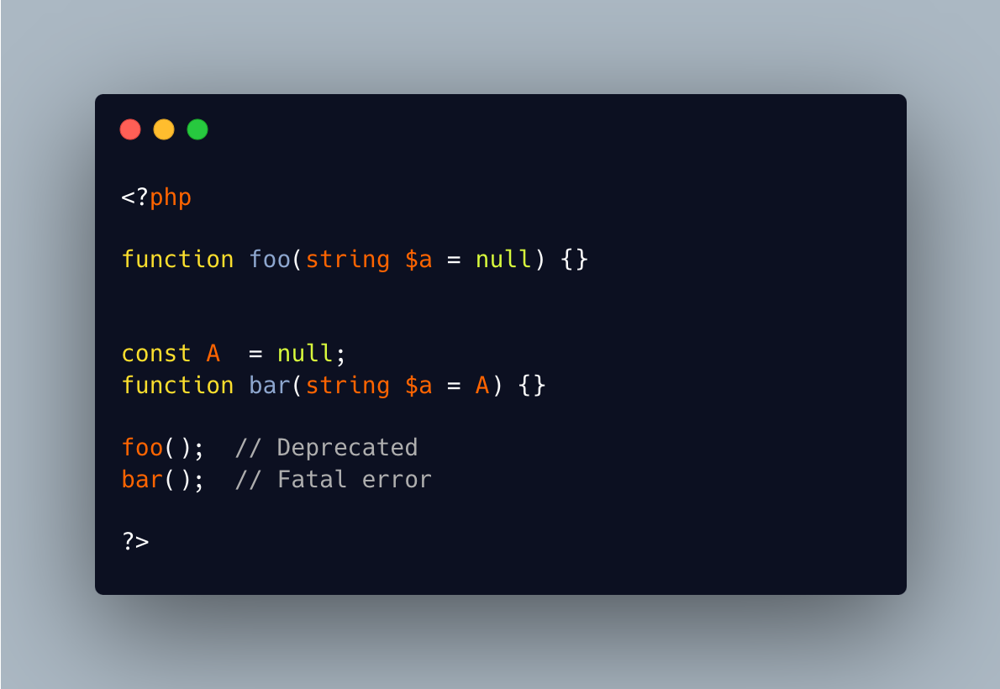

.. _no-hidden-nullable:

No Hidden Nullable
------------------

.. meta::
	:description:
		No Hidden Nullable: A hidden nullable is a, now deprecated, PHP features where typed parameters with a default value of ``null`` are automatically nullable.
	:twitter:card: summary_large_image
	:twitter:site: @exakat
	:twitter:title: No Hidden Nullable
	:twitter:description: No Hidden Nullable: A hidden nullable is a, now deprecated, PHP features where typed parameters with a default value of ``null`` are automatically nullable
	:twitter:creator: @exakat
	:twitter:image:src: https://php-tips.readthedocs.io/en/latest/_images/no-hidden-nullable.png
	:og:image: https://php-tips.readthedocs.io/en/latest/_images/no-hidden-nullable.png
	:og:title: No Hidden Nullable
	:og:type: article
	:og:description: A hidden nullable is a, now deprecated, PHP features where typed parameters with a default value of ``null`` are automatically nullable
	:og:url: https://php-tips.readthedocs.io/en/latest/tips/no-hidden-nullable.html
	:og:locale: en

.. raw:: html

	

A hidden nullable is a, now deprecated, PHP features where typed parameters with a default value of ``null`` are automatically nullable.

Well, that is true only if PHP can spot the ``null`` at compilation time: when the ``null`` is hidden (sic) in a constant, then it is not recognized, and it leads to a Fatal Error.

This is due to PHP postponing the evaluation of the constant to execution phase.

See Also
________

* `Hidden and not so hidden <https://3v4l.org/g846c>`_ [Try me]

