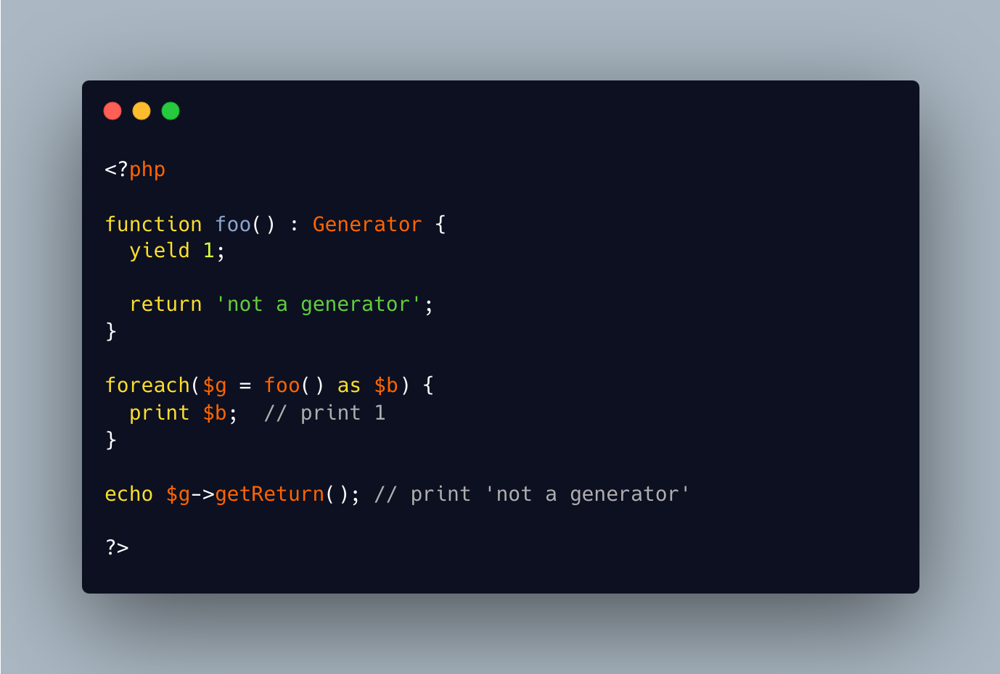

.. _no-returntype-enforced:

No Returntype Enforced
----------------------

.. meta::
	:description:
		No Returntype Enforced: A return type on a method means that the method must return something of that type.
	:twitter:card: summary_large_image
	:twitter:site: @exakat
	:twitter:title: No Returntype Enforced
	:twitter:description: No Returntype Enforced: A return type on a method means that the method must return something of that type
	:twitter:creator: @exakat
	:twitter:image:src: https://php-tips.readthedocs.io/en/latest/_images/no-returntype-enforced.png
	:og:image: https://php-tips.readthedocs.io/en/latest/_images/no-returntype-enforced.png
	:og:title: No Returntype Enforced
	:og:type: article
	:og:description: A return type on a method means that the method must return something of that type
	:og:url: https://php-tips.readthedocs.io/en/latest/tips/no-returntype-enforced.html
	:og:locale: en

.. raw:: html

	

A return type on a method means that the method must return something of that type. This is true, unless for generators. Such methods contains ``yield`` or ``yield from``, and must use the ``Generator`` returntype. Then, the actual return type is not checked, at all.

See Also
________

* `Generator syntax (PHP manual) <https://www.php.net/manual/en/language.generators.syntax.php>`_

