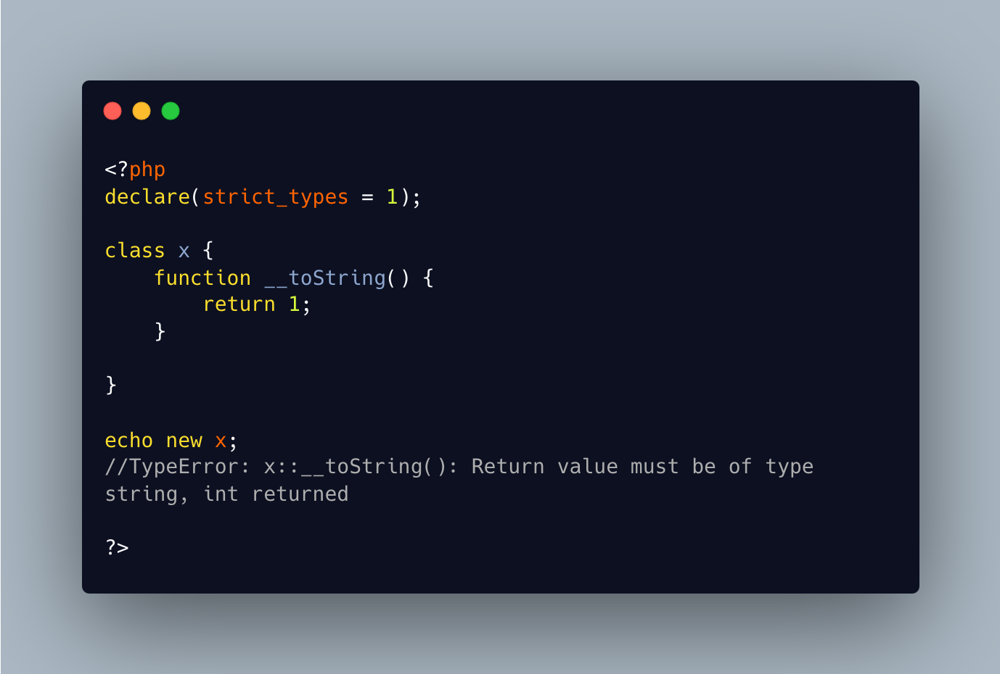

.. _no-returntype-but-still,-only-string:

No Returntype But Still, Only String
------------------------------------

.. meta::
	:description:
		No Returntype But Still, Only String: Without a return type (or mixed), a method may return any type of data.
	:twitter:card: summary_large_image
	:twitter:site: @exakat
	:twitter:title: No Returntype But Still, Only String
	:twitter:description: No Returntype But Still, Only String: Without a return type (or mixed), a method may return any type of data
	:twitter:creator: @exakat
	:twitter:image:src: https://php-tips.readthedocs.io/en/latest/_images/no-type-but-string.png
	:og:image: https://php-tips.readthedocs.io/en/latest/_images/no-type-but-string.png
	:og:title: No Returntype But Still, Only String
	:og:type: article
	:og:description: Without a return type (or mixed), a method may return any type of data
	:og:url: https://php-tips.readthedocs.io/en/latest/tips/no-type-but-string.html
	:og:locale: en

.. raw:: html

	

By `Fred Bouchery <https://bsky.app/profile/bouchery.fr>`_

Without a return type (or mixed), a method may return any type of data. This is not the case for the magic method ``__toString``, as it really should return a string. So, even without a return type, it complains about the type.

That trick requires ``strict_types`` though.

See Also
________

* `Magic methods (PHP manual) <https://www.php.net/manual/en/language.oop5.magic.php>`_
* `Declare <https://www.php.net/manual/en/control-structures.declare.php>`_

