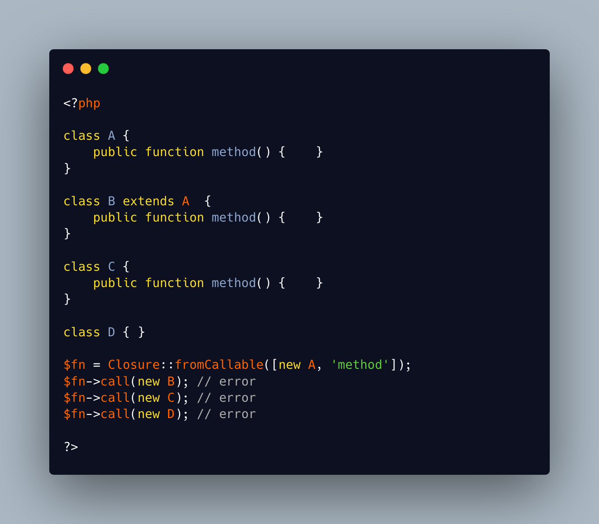

.. _no-binding-but-with-original:

No Binding But With Original
----------------------------

.. meta::
	:description:
		No Binding But With Original: It is possible to change the underlying object of a closure.
	:twitter:card: summary_large_image
	:twitter:site: @exakat
	:twitter:title: No Binding But With Original
	:twitter:description: No Binding But With Original: It is possible to change the underlying object of a closure
	:twitter:creator: @exakat
	:twitter:image:src: https://php-tips.readthedocs.io/en/latest/_images/noBindingButOriginal.png
	:og:image: https://php-tips.readthedocs.io/en/latest/_images/noBindingButOriginal.png
	:og:title: No Binding But With Original
	:og:type: article
	:og:description: It is possible to change the underlying object of a closure
	:og:url: https://php-tips.readthedocs.io/en/latest/tips/noBindingButOriginal.html
	:og:locale: en

.. raw:: html

	

It is possible to change the underlying object of a closure. The new closure will be executed with the new object, with the same method.

On the other hand, it is not possible to call that closure on another class, even if that class has the same method, nor even if the class is a child of the original one. It must be the same original class.

See Also
________

* `The Closure class (PHP manual) <https://www.php.net/manual/en/class.closure.php>`_
* `Rebind to object <https://3v4l.org/stFK6>`_ [Try me]

PHP Error Messages
__________________

* `Cannot rebind scope of closure created from method <https://php-errors.readthedocs.io/en/latest/messages/cannot-rebind-scope-of-closure-created-from-method.html>`_

PHP Features
____________

* `closure <https://php-dictionary.readthedocs.io/en/latest/dictionary/closure.ini.html>`_

* `bind <https://php-dictionary.readthedocs.io/en/latest/dictionary/bind.ini.html>`_

