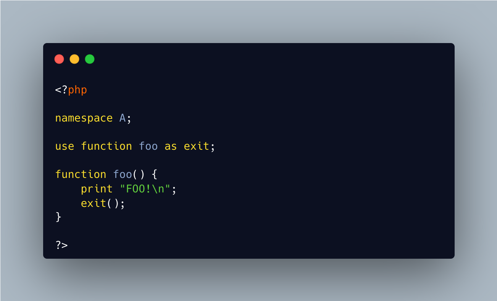

.. _no-rewrite-for-exit:

No Rewrite For Exit
-------------------

.. meta::
	:description:
		No Rewrite For Exit: Since PHP 8.
	:twitter:card: summary_large_image
	:twitter:site: @exakat
	:twitter:title: No Rewrite For Exit
	:twitter:description: No Rewrite For Exit: Since PHP 8
	:twitter:creator: @exakat
	:twitter:image:src: https://php-tips.readthedocs.io/en/latest/_images/noExitRewrite.png
	:og:image: https://php-tips.readthedocs.io/en/latest/_images/noExitRewrite.png
	:og:title: No Rewrite For Exit
	:og:type: article
	:og:description: Since PHP 8
	:og:url: https://php-tips.readthedocs.io/en/latest/tips/noExitRewrite.html
	:og:locale: en

.. raw:: html

	

Since PHP 8.4, ``exit()`` is also a function, and may be called as such.

Yet, it is still a PHP keyword, so it cannot be used as a function name: this would allow creating functions with that name in namespaces. On the other hand, it is possible to use that name as a method name.

And it is also not possible to use ``exit`` in a ``use`` command: that would allow rewriting exit with another function.

See Also
________

* `exit (PHP manual) <https://www.php.net/manual/en/function.exit.php>`_
* `No use for exit <https://3v4l.org/QukZb>`_ [Try me]

PHP Error Messages
__________________

* `syntax error, unexpected token "exit", expecting identifier <https://php-errors.readthedocs.io/en/latest/messages/syntax-error%2C-unexpected-token-%22exit%22.html>`_

PHP Features
____________

* `exit <https://php-dictionary.readthedocs.io/en/latest/dictionary/exit.ini.html>`_

* `use <https://php-dictionary.readthedocs.io/en/latest/dictionary/use.ini.html>`_

* `relaxed-syntax <https://php-dictionary.readthedocs.io/en/latest/dictionary/relaxed-syntax.ini.html>`_

