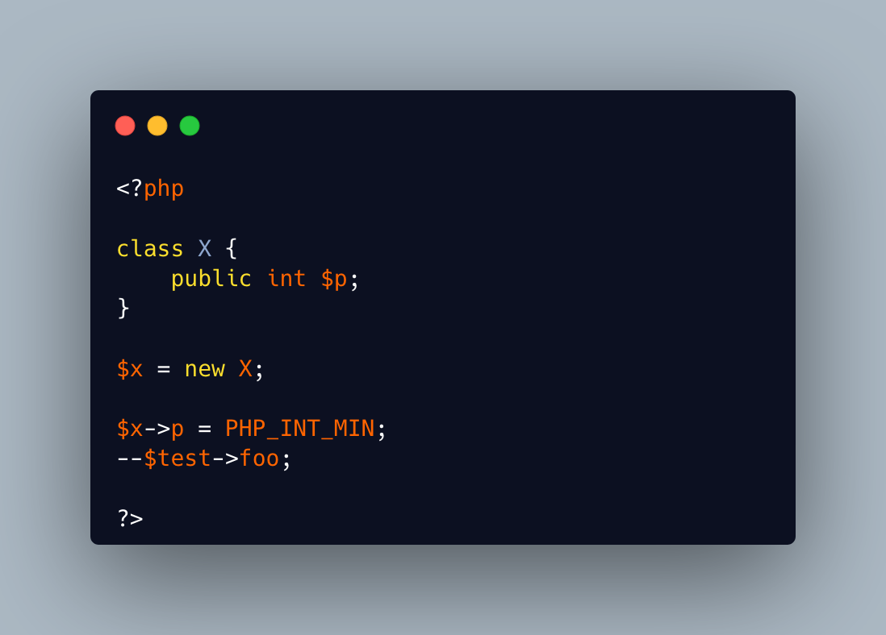

.. _no-property-beyond-limits:

No Property Beyond Limits
-------------------------

.. meta::
	:description:
		No Property Beyond Limits: TIL that PHP reports attempts to go beyond the limits (upper and lower) of integer properties.
	:twitter:card: summary_large_image
	:twitter:site: @exakat
	:twitter:title: No Property Beyond Limits
	:twitter:description: No Property Beyond Limits: TIL that PHP reports attempts to go beyond the limits (upper and lower) of integer properties
	:twitter:creator: @exakat
	:twitter:image:src: https://php-tips.readthedocs.io/en/latest/_images/noPropertyBelowMininum.png
	:og:image: https://php-tips.readthedocs.io/en/latest/_images/noPropertyBelowMininum.png
	:og:title: No Property Beyond Limits
	:og:type: article
	:og:description: TIL that PHP reports attempts to go beyond the limits (upper and lower) of integer properties
	:og:url: https://php-tips.readthedocs.io/en/latest/tips/noPropertyBelowMininum.html
	:og:locale: en

.. raw:: html

	

TIL that PHP reports attempts to go beyond the limits (upper and lower) of integer properties. Indeed, beyond these limits, the property is converted to a float, which violate the typing.

This error goes away by dropping the type: the property simply changes type.

This also means that no error is reported when doing the same on a variable.

See Also
________

* `No decrement <https://3v4l.org/b6JKa>`_ [Try me]

PHP Error Messages
__________________

* `Cannot decrement property %s::$%s of type int past its minimal value <https://php-errors.readthedocs.io/en/latest/messages/cannot-decrement-property-%25s%3A%3A%24%25s-of-type-int-past-its-minimal-value.html>`_

* `Cannot increment property %s::$%s of type int past its maximal value <https://php-errors.readthedocs.io/en/latest/messages/cannot-increment-property-%25s%3A%3A%24%25s-of-type-int-past-its-maximal-value.html>`_

* `Cannot assign %s to property %s::$%s of type %s <https://php-errors.readthedocs.io/en/latest/messages/cannot-assign-%25s-to-property-%25s%3A%3A%24%25s-of-type-%25s.html>`_

