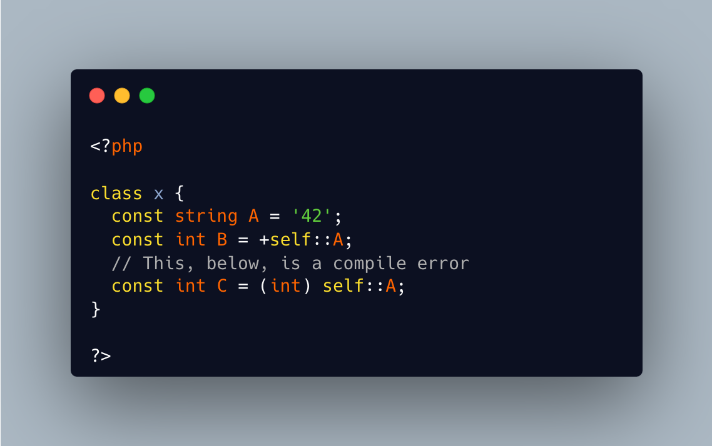

.. _no-cast-in-constant-expressions:

No Cast In Constant Expressions
-------------------------------

.. meta::
	:description:
		No Cast In Constant Expressions: Constant expressions do not accept the cast operator.
	:twitter:card: summary_large_image
	:twitter:site: @exakat
	:twitter:title: No Cast In Constant Expressions
	:twitter:description: No Cast In Constant Expressions: Constant expressions do not accept the cast operator
	:twitter:creator: @exakat
	:twitter:image:src: https://php-tips.readthedocs.io/en/latest/_images/no_cast_in_constant_expression.png
	:og:image: https://php-tips.readthedocs.io/en/latest/_images/no_cast_in_constant_expression.png
	:og:title: No Cast In Constant Expressions
	:og:type: article
	:og:description: Constant expressions do not accept the cast operator
	:og:url: https://php-tips.readthedocs.io/en/latest/tips/no_cast_in_constant_expression.html
	:og:locale: en

.. raw:: html

	

Constant expressions do not accept the cast operator.

Constant expressions are expressions defining constants and default values. They allow a subset of PHP features, as they are avaiable before the execution phase. For example, they accept operators, such as addition and concatenation. Yet, they do not accept the cast operators, even though they might be emulated in another way. Here, the + operator creates the integer, from another string.

See Also
________

* `Class constants (PHP manual) <https://www.php.net/manual/en/language.oop5.constants.php>`_

