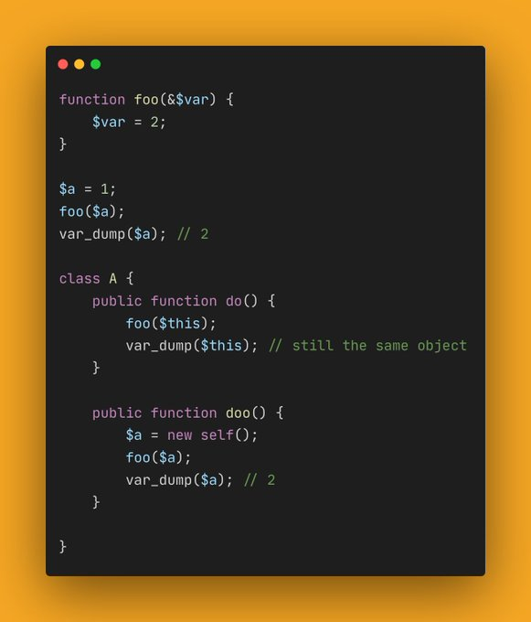

.. _no-change-to-$this:

No Change To $this
------------------

.. meta::
	:description:
		No Change To $this: Variable ``$this`` is passed and reassigned by reference is a noop, as opposed to all other variables.

By `Ondrej Mirtes <https://twitter.com/OndrejMirtes>`_

Variable ``$this`` is passed and reassigned by reference is a noop, as opposed to all other variables. I'd expect an error to be honest.

* `Original tweet <https://twitter.com/OndrejMirtes/status/1750522433633927620>`_
* `Running code <https://3v4l.org/2PkHO>`_

