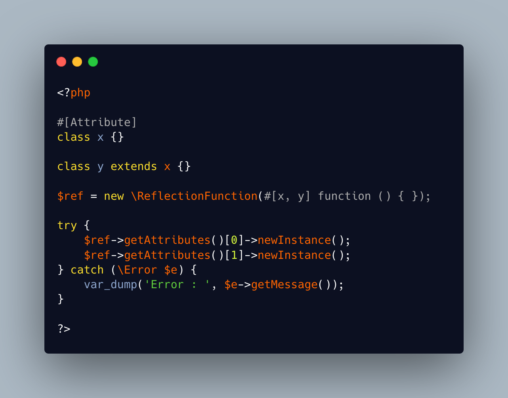

.. _child-of-attribute-is-not-an-attribute:

Child Of Attribute Is Not An Attribute
--------------------------------------

.. meta::
	:description:
		Child Of Attribute Is Not An Attribute: A class attribute must be marked with an attribute called ``Attribute``.
	:twitter:card: summary_large_image
	:twitter:site: @exakat
	:twitter:title: Child Of Attribute Is Not An Attribute
	:twitter:description: Child Of Attribute Is Not An Attribute: A class attribute must be marked with an attribute called ``Attribute``
	:twitter:creator: @exakat
	:twitter:image:src: https://php-tips.readthedocs.io/en/latest/_images/no_child_with_attribute.png
	:og:image: https://php-tips.readthedocs.io/en/latest/_images/no_child_with_attribute.png
	:og:title: Child Of Attribute Is Not An Attribute
	:og:type: article
	:og:description: A class attribute must be marked with an attribute called ``Attribute``
	:og:url: https://php-tips.readthedocs.io/en/latest/tips/no_child_with_attribute.html
	:og:locale: en

.. raw:: html

	

A class attribute must be marked with an attribute called ``Attribute``. It is compulsory to use Reflection and obtain an instance of the attribute.

That attribute is only for the class itself, and it doesn't propagate automatically to the child classes.

On the other hand, the ``Attribute`` class cannot be extended: it is not possible to create a child that may carry some of the ``Attribute`` properties.

See Also
________

* `Attributes Overview (PHP manual) <https://www.php.net/manual/en/language.attributes.overview.php>`_
* `attribute is not for children <https://3v4l.org/tDOsd>`_ [Try me]

PHP Features
____________

* `reflection <https://php-dictionary.readthedocs.io/en/latest/dictionary/reflection.ini.html>`_

* `attribute <https://php-dictionary.readthedocs.io/en/latest/dictionary/attribute.ini.html>`_

* `inheritance <https://php-dictionary.readthedocs.io/en/latest/dictionary/inheritance.ini.html>`_

