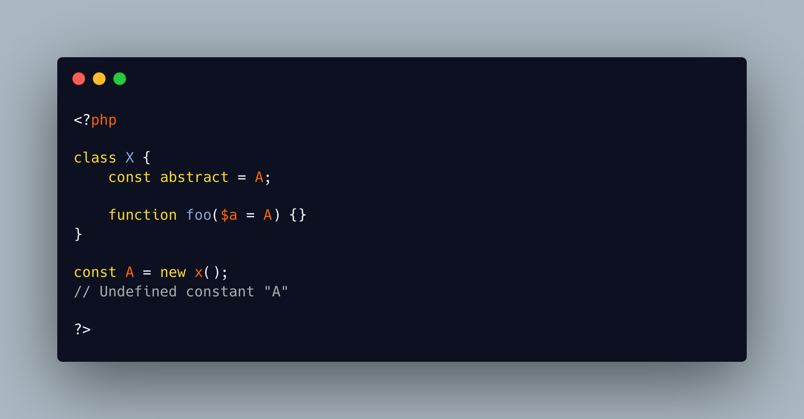

.. _undefined-constant-a-on-its-line-of-definition:

Undefined Constant A On Its Line Of Definition
----------------------------------------------

.. meta::
	:description:
		Undefined Constant A On Its Line Of Definition: This piece of code returns a puzzling error: 'Undefined constant A', on the line 9.
	:twitter:card: summary_large_image
	:twitter:site: @exakat
	:twitter:title: Undefined Constant A On Its Line Of Definition
	:twitter:description: Undefined Constant A On Its Line Of Definition: This piece of code returns a puzzling error: 'Undefined constant A', on the line 9
	:twitter:creator: @exakat
	:twitter:image:src: https://php-tips.readthedocs.io/en/latest/_images/no_const_A.png
	:og:image: https://php-tips.readthedocs.io/en/latest/_images/no_const_A.png
	:og:title: Undefined Constant A On Its Line Of Definition
	:og:type: article
	:og:description: This piece of code returns a puzzling error: 'Undefined constant A', on the line 9
	:og:url: https://php-tips.readthedocs.io/en/latest/tips/no_const_A.html
	:og:locale: en

.. raw:: html

	

This piece of code returns a puzzling error: 'Undefined constant A', on the line 9. This is the line where the constant is defined. And it is not the case of a recursively defined constant (aka, ``const A = A + 1;``).

Since PHP 8.1, global constants can hold an object. This also means that at the time of definition, the class definition is loaded by PHP. This is the case in this code.

After inspection of the class, the constant ``A`` is used twice : once as class constant, and once as a default value. The latter is actually valid, as PHP only requires such values to be available when the method is called, without the related parameter. 

The culprit is actually the class constant, which requires its value to be immediately set, for obvious consistency reasons. This is where the definition recursion happens.

In the end, the error message on line 9 is just very misleading.

See Also
________

* `New In Initializer (PHP manual) <https://wiki.php.net/rfc/new_in_initializers>`_
* `Undefined Constant A <https://3v4l.org/cAQ9P>`_ [Try me]

PHP Features
____________

* `new-in-initializer <https://php-dictionary.readthedocs.io/en/latest/dictionary/new-in-initializer.ini.html>`_

* `constant <https://php-dictionary.readthedocs.io/en/latest/dictionary/constant.ini.html>`_

