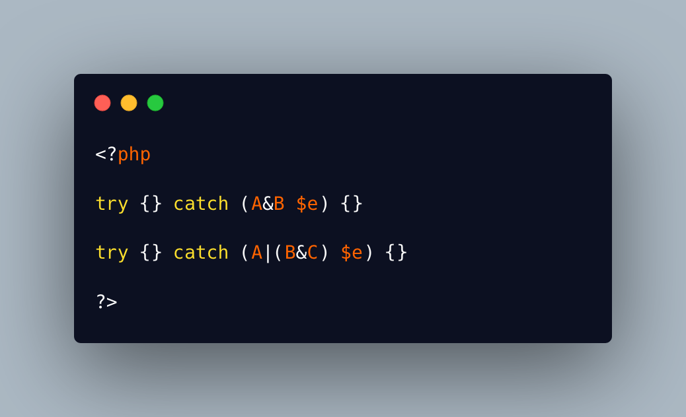

.. _no-dnf-for-catch:

No DNF For Catch
----------------

.. meta::
	:description:
		No DNF For Catch: Catch clauses accept multiple types of exceptions, since PHP 7.
	:twitter:card: summary_large_image
	:twitter:site: @exakat
	:twitter:title: No DNF For Catch
	:twitter:description: No DNF For Catch: Catch clauses accept multiple types of exceptions, since PHP 7
	:twitter:creator: @exakat
	:twitter:image:src: https://php-tips.readthedocs.io/en/latest/_images/no_dnf_for_catch.png.png
	:og:image: https://php-tips.readthedocs.io/en/latest/_images/no_dnf_for_catch.png
	:og:title: No DNF For Catch
	:og:type: article
	:og:description: Catch clauses accept multiple types of exceptions, since PHP 7
	:og:url: https://php-tips.readthedocs.io/en/latest/tips/no_dnf_for_catch.html
	:og:locale: en

Catch clauses accept multiple types of exceptions, since PHP 7.1: they are listed with the '|' separator.

This looks like the union type of PHP 8.0, and actually acts like it.

Yet, this is not a normal type, because the intersectional and the DNF format are not supported at parsing time. Thus, the two expressions below generate an error.

* `Catch (PHP manual) <https://www.php.net/manual/en/language.exceptions.php#language.exceptions.catch>`_
* `Type declarations <https://www.php.net/manual/en/language.exceptions.php#language.exceptions.catch>`_

