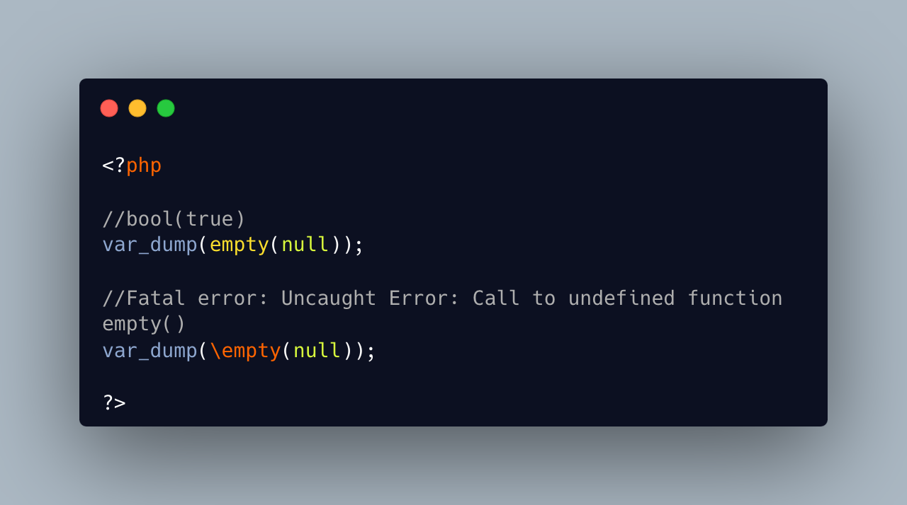

.. _no-such-function-as-empty:

No Such Function As Empty
-------------------------

.. meta::
	:description:
		No Such Function As Empty: There is no function called empty(), which could be accessed using a fully qualified name, such as ``\empty``.
	:twitter:card: summary_large_image
	:twitter:site: @exakat
	:twitter:title: No Such Function As Empty
	:twitter:description: No Such Function As Empty: There is no function called empty(), which could be accessed using a fully qualified name, such as ``\empty``
	:twitter:creator: @exakat
	:twitter:image:src: https://php-tips.readthedocs.io/en/latest/_images/no_empty_function.png
	:og:image: https://php-tips.readthedocs.io/en/latest/_images/no_empty_function.png
	:og:title: No Such Function As Empty
	:og:type: article
	:og:description: There is no function called empty(), which could be accessed using a fully qualified name, such as ``\empty``
	:og:url: https://php-tips.readthedocs.io/en/latest/tips/no_empty_function.html
	:og:locale: en

There is no function called empty(), which could be accessed using a fully qualified name, such as ``\empty``. There is also no function that can be defined as such, since empty() is already taken.

When the code needs to pass around a ``empty function``, the best approach is to wrap a call to the ``empty()`` language construct, in a closure.

* `Empty (PHP manual) <https://www.php.net/manual/en/function.empty.php>`_
* `Language constructs <https://www.php.net/manual/en/control-structures.intro.php>`_

