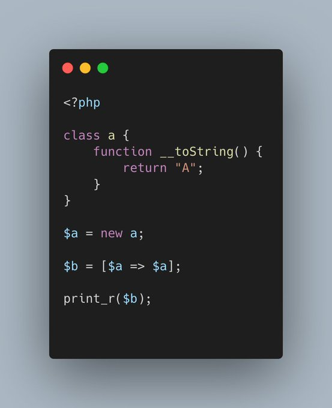

.. _no-force-object-to-string:

No Force Object To String
-------------------------

.. meta::
	:description:
		No Force Object To String: PHP forces numeric strings to integers when using them as a index, in an array.

PHP forces numeric strings to integers when using them as a index, in an array. On the other hand, it doesn't force objects to be strings, and it rather raise an error: ``Illegal offset type``.

* `Arrays (PHP manual) <https://www.php.net/manual/en/language.types.array.php>`_

