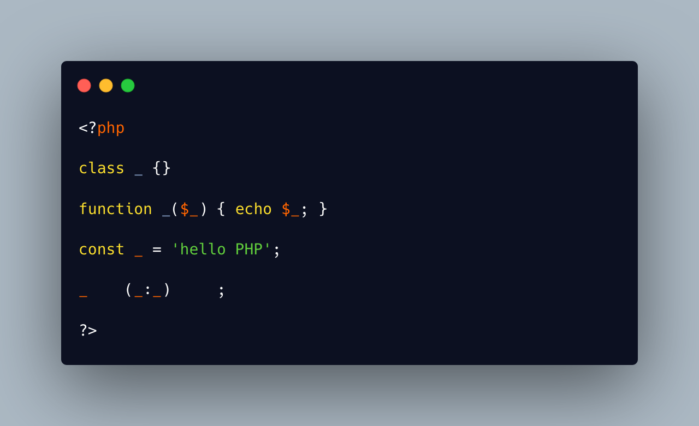

.. _no-more-class-_:

No More Class _
---------------

.. meta::
	:description:
		No More Class _: Naming a class ``_`` has been deprecated in PHP 8.
	:twitter:card: summary_large_image
	:twitter:site: @exakat
	:twitter:title: No More Class _
	:twitter:description: No More Class _: Naming a class ``_`` has been deprecated in PHP 8
	:twitter:creator: @exakat
	:twitter:image:src: https://php-tips.readthedocs.io/en/latest/_images/no_more_class__.png
	:og:image: https://php-tips.readthedocs.io/en/latest/_images/no_more_class__.png
	:og:title: No More Class _
	:og:type: article
	:og:description: Naming a class ``_`` has been deprecated in PHP 8
	:og:url: https://php-tips.readthedocs.io/en/latest/tips/no_more_class__.html
	:og:locale: en

.. raw:: html

	

Naming a class ``_`` has been deprecated in PHP 8.4.

Luckily, that name is still available for functions and constants, which gives this beauty.

There is already a PHP extension function called ``_``, which is an alias of gettext(), from the gettext extension (sic). If you try this at home, avoid loading that extension, disable the ``_()`` with disable_function, or call it ``__()``.

See Also
________

* `The Basics (PHP manual) <https://www.php.net/manual/en/language.oop5.basic.php>`_
* `ext/gettext <https://www.php.net/manual/en/book.gettext.php>`_
* `gettext() <https://www.php.net/manual/en/function.gettext.php>`_
* `no more class _ <https://3v4l.org/bfh8v>`_

