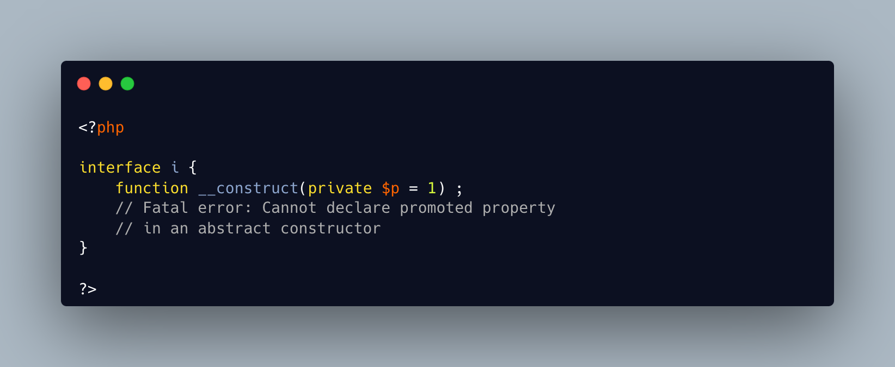

.. _no-property-in-interface:

No Property In Interface
------------------------

.. meta::
	:description:
		No Property In Interface: PHP is better than me : I thought I found a way to create properties in an interface, by declaring promoted properties in a constructor.
	:twitter:card: summary_large_image
	:twitter:site: @exakat
	:twitter:title: No Property In Interface
	:twitter:description: No Property In Interface: PHP is better than me : I thought I found a way to create properties in an interface, by declaring promoted properties in a constructor
	:twitter:creator: @exakat
	:twitter:image:src: https://php-tips.readthedocs.io/en/latest/_images/no_property_in_interface.png
	:og:image: https://php-tips.readthedocs.io/en/latest/_images/no_property_in_interface.png
	:og:title: No Property In Interface
	:og:type: article
	:og:description: PHP is better than me : I thought I found a way to create properties in an interface, by declaring promoted properties in a constructor
	:og:url: https://php-tips.readthedocs.io/en/latest/tips/no_property_in_interface.html
	:og:locale: en

.. raw:: html

	

PHP is better than me : I thought I found a way to create properties in an interface, by declaring promoted properties in a constructor.

Someone coding the PHP engine was smarter than me : it feels so good! (BTW, who would that be?)

It's also going to save me some sanity, as I don't have to upgrade my Static Analysis Engine.

Note that PHP 8.4 introduced properties in interfaces, as long as they have property hooks.

See Also
________

* `Interfaces (PHP manual) <https://www.php.net/manual/en/language.oop5.interfaces.php>`_
* `this function never returns <https://3v4l.org/X3KJH>`_ [Try me]

PHP Features
____________

* `interface <https://php-dictionary.readthedocs.io/en/latest/dictionary/interface.ini.html>`_

* `promoted-property <https://php-dictionary.readthedocs.io/en/latest/dictionary/promoted-property.ini.html>`_

