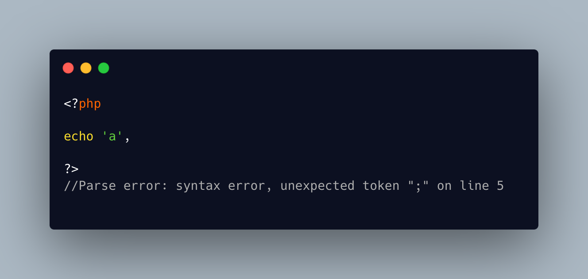

.. _no-semicolon-in-sight:

No Semicolon In Sight
---------------------

.. meta::
	:description:
		No Semicolon In Sight: This PHP code doesn't compile: the echo must be complete to be closed with a PHP tag.
	:twitter:card: summary_large_image
	:twitter:site: @exakat
	:twitter:title: No Semicolon In Sight
	:twitter:description: No Semicolon In Sight: This PHP code doesn't compile: the echo must be complete to be closed with a PHP tag
	:twitter:creator: @exakat
	:twitter:image:src: https://php-tips.readthedocs.io/en/latest/_images/no_semi_colon_in_sight.png
	:og:image: https://php-tips.readthedocs.io/en/latest/_images/no_semi_colon_in_sight.png
	:og:title: No Semicolon In Sight
	:og:type: article
	:og:description: This PHP code doesn't compile: the echo must be complete to be closed with a PHP tag
	:og:url: https://php-tips.readthedocs.io/en/latest/tips/no_semi_colon_in_sight.html
	:og:locale: en

.. raw:: html

	

By `Ryan Chandler <https://twitter.com/ryangjchandler>`_

This PHP code doesn't compile: the echo must be complete to be closed with a PHP tag. Either the comma should be a semicolon, or an extra argument should be present.

In any case, the linting error message reports an unexpected semicolon, which is not visible in the code. Indeed, it is hidden in the PHP closing tag.

See Also
________

* `PHP tags <https://www.php.net/manual/en/language.basic-syntax.phptags.php>`_
* `this function never returns <https://3v4l.org/X3KJH>`_ [Try me]

PHP Error Messages
__________________

* `syntax error, unexpected token ";" <https://php-errors.readthedocs.io/en/latest/messages/syntax-error%2C-unexpected-token-%22%3B%22.ini.html>`_

