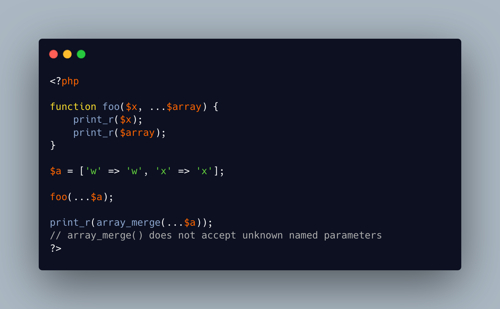

.. _no-unknown-for-array_merge():

No Unknown For array_merge()
----------------------------

.. meta::
	:description:
		No Unknown For array_merge(): A PHP variadic argument collects all the unused named parameters, along with their key.
	:twitter:card: summary_large_image
	:twitter:site: @exakat
	:twitter:title: No Unknown For array_merge()
	:twitter:description: No Unknown For array_merge(): A PHP variadic argument collects all the unused named parameters, along with their key
	:twitter:creator: @exakat
	:twitter:image:src: https://php-tips.readthedocs.io/en/latest/_images/no_unknown_for_array_merge.png
	:og:image: https://php-tips.readthedocs.io/en/latest/_images/no_unknown_for_array_merge.png
	:og:title: No Unknown For array_merge()
	:og:type: article
	:og:description: A PHP variadic argument collects all the unused named parameters, along with their key
	:og:url: https://php-tips.readthedocs.io/en/latest/tips/no_unknown_for_array_merge.html
	:og:locale: en

.. raw:: html

	

A PHP variadic argument collects all the unused named parameters, along with their key.  That way, it is possible to handle them with their name inside the method.

On the other hand, array_merge (and some cousins) refuse them, and emits a Fatal error. There, it is important to use array_values() to avoid named parameters.

See Also
________

* `array_merge (PHP manual) <hhttps://www.php.net/array_merge>`_
* `Functions arguments <https://www.php.net/manual/en/functions.arguments.php>`_

