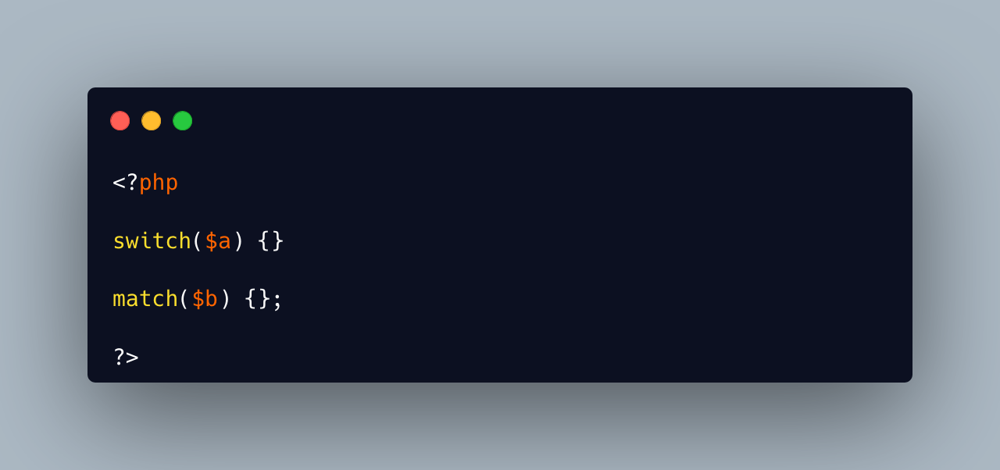

.. _non-empty-match:

Non Empty Match
---------------

.. meta::
	:description:
		Non Empty Match: PHP allows the empty ``switch``: that is, a switch command with an empty block of cases.
	:twitter:card: summary_large_image
	:twitter:site: @exakat
	:twitter:title: Non Empty Match
	:twitter:description: Non Empty Match: PHP allows the empty ``switch``: that is, a switch command with an empty block of cases
	:twitter:creator: @exakat
	:twitter:image:src: https://php-tips.readthedocs.io/en/latest/_images/non-empty-match.png
	:og:image: https://php-tips.readthedocs.io/en/latest/_images/non-empty-match.png
	:og:title: Non Empty Match
	:og:type: article
	:og:description: PHP allows the empty ``switch``: that is, a switch command with an empty block of cases
	:og:url: https://php-tips.readthedocs.io/en/latest/tips/non-empty-match.html
	:og:locale: en

.. raw:: html

	

PHP allows the empty ``switch``: that is, a switch command with an empty block of cases. The whole expression does nothing, and it is as useless as an if statement with an empty block.

The ``match`` statement, on the other hand, compiles just like the ``switch`` but it also enforces the default case, with an ``Uncaught UnhandledMatchError: Unhandled match case NULL`` exception. This one must be cautght, or one must add a ``default`` case, with a value, to the ``match`` to keep it useless.

See Also
________

* `switch (PHP manual) <https://www.php.net/manual/en/control-structures.match.php>`_
* `match (PHP manual) <https://www.php.net/manual/en/control-structures.switch.php>`_
* `unhandled case with NULL <https://3v4l.org/OHMUb>`_ [Try me]

PHP Error Messages
__________________

* `Unhandled case NULL <https://php-errors.readthedocs.io/en/latest/messages/unhandled-match-case-%25s.html>`_

