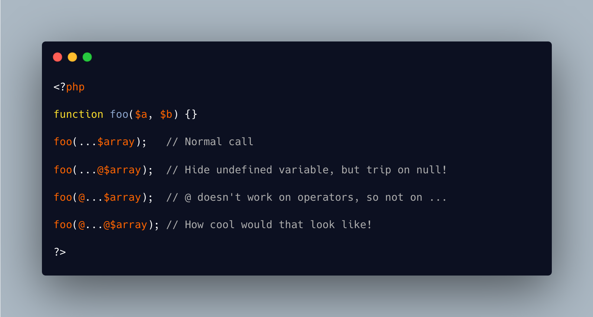

.. _noscream-on-ellipsis:

Noscream On Ellipsis
--------------------

.. meta::
	:description:
		Noscream On Ellipsis: Noscream operator @ hides errors locally, in an expression.
	:twitter:card: summary_large_image
	:twitter:site: @exakat
	:twitter:title: Noscream On Ellipsis
	:twitter:description: Noscream On Ellipsis: Noscream operator @ hides errors locally, in an expression
	:twitter:creator: @exakat
	:twitter:image:src: https://php-tips.readthedocs.io/en/latest/_images/noscream-on-ellipsis.png
	:og:image: https://php-tips.readthedocs.io/en/latest/_images/noscream-on-ellipsis.png
	:og:title: Noscream On Ellipsis
	:og:type: article
	:og:description: Noscream operator @ hides errors locally, in an expression
	:og:url: https://php-tips.readthedocs.io/en/latest/tips/noscream-on-ellipsis.html
	:og:locale: en

Noscream operator @ hides errors locally, in an expression. Variadic ``...`` spreads the elements of an array.

What happens when the two are mixed?

@ works on a variable, but it will yield a NULL when the variable is undefined, which is a fatal error when used with ellipsis. So, this is legit, but also a dead end.

@ doesn't work on operators, so it is not possible to put it before the ellipsis, without a compilation error.

Finally, the syntax ``@...@`` would be definitely cool. Crazy, but cool. Don't use it.

* `Error control operator (PHP manual) <https://www.php.net/manual/en/language.operators.errorcontrol.php>`_
* `Array unpacking <https://www.php.net/manual/en/language.types.array.php#language.types.array.unpacking>`_

