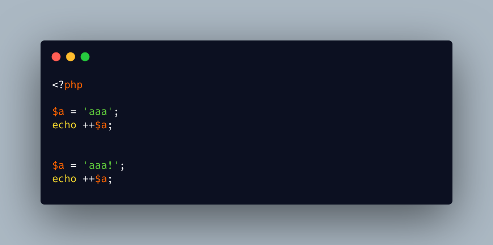

.. _not-all-incremented-strings-are-deprecated:

Not All Incremented Strings Are Deprecated
------------------------------------------

.. meta::
	:description:
		Not All Incremented Strings Are Deprecated: News are that the famous PHP feature to increment strings is deprecated.
	:twitter:card: summary_large_image
	:twitter:site: @exakat
	:twitter:title: Not All Incremented Strings Are Deprecated
	:twitter:description: Not All Incremented Strings Are Deprecated: News are that the famous PHP feature to increment strings is deprecated
	:twitter:creator: @exakat
	:twitter:image:src: https://php-tips.readthedocs.io/en/latest/_images/notAllIncrementStrings.png
	:og:image: https://php-tips.readthedocs.io/en/latest/_images/notAllIncrementStrings.png
	:og:title: Not All Incremented Strings Are Deprecated
	:og:type: article
	:og:description: News are that the famous PHP feature to increment strings is deprecated
	:og:url: https://php-tips.readthedocs.io/en/latest/tips/notAllIncrementStrings.html
	:og:locale: en

.. raw:: html

	

News are that the famous PHP feature to increment strings is deprecated. This is not entirely true, as only the strings that can't be incremented emit the warning since PHP 8.3.

Truth is, this will be corrected in PHP 8.5, so better start using str_increment() and str_decrement() anyway.

See Also
________

* `Saner Increment/Decrement operators <https://www.php.net/manual/en/migration83.deprecated.php#migration83.deprecated.core.saner-inc-dec-operators>`_
* `Increment me! <https://3v4l.org/hj3ac>`_ [Try me]

PHP Error Messages
__________________

* `Increment on non-alphanumeric string is deprecated  <https://php-errors.readthedocs.io/en/latest/messages/increment-on-non-alphanumeric-string-is-deprecated.html>`_

PHP Features
____________

* `string-increment <https://php-dictionary.readthedocs.io/en/latest/dictionary/string-increment.ini.html>`_

