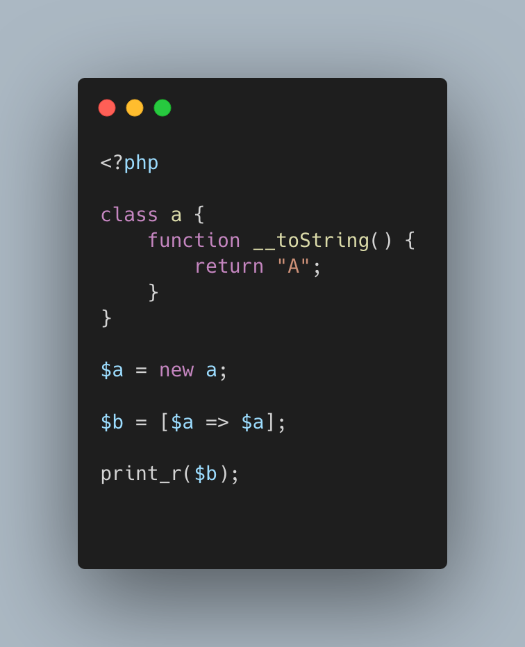

.. _not-all-strings-in-arrays:

Not All Strings In Arrays
-------------------------

.. meta::
	:description:
		Not All Strings In Arrays: Array keys are coerced into strings or integers, while array values are left intact.
	:twitter:card: summary_large_image
	:twitter:site: @exakat
	:twitter:title: Not All Strings In Arrays
	:twitter:description: Not All Strings In Arrays: Array keys are coerced into strings or integers, while array values are left intact
	:twitter:creator: @exakat
	:twitter:image:src: https://php-tips.readthedocs.io/en/latest/_images/not_all_strings.png
	:og:image: https://php-tips.readthedocs.io/en/latest/_images/not_all_strings.png
	:og:title: Not All Strings In Arrays
	:og:type: article
	:og:description: Array keys are coerced into strings or integers, while array values are left intact
	:og:url: https://php-tips.readthedocs.io/en/latest/tips/not_all_strings.html
	:og:locale: en

Array keys are coerced into strings or integers, while array values are left intact.

Yet, this doesn't apply to array keys, so this code will display an 'Uncaught TypeError: Illegal offset type', even without strict_types.

This code needs an explicit cast to string to work.

* `Array: syntax (PHP manual) <https://www.php.net/manual/en/language.types.array.php>`_
* `__toString() Magic Method <https://www.php.net/manual/fr/language.oop5.magic.php#object.tostring>`_

