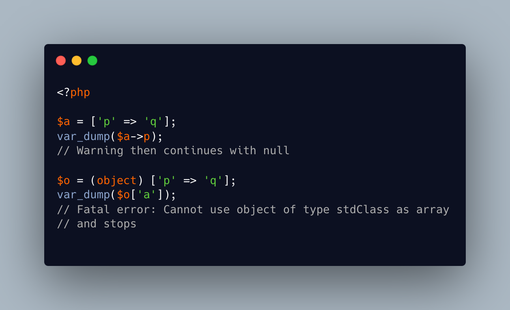

.. _array-and-object-syntax,-not-the-same-error:

Array And Object Syntax, Not The Same Error
-------------------------------------------

.. meta::
	:description:
		Array And Object Syntax, Not The Same Error: When accessing an array as an object, PHP raises a Warning and continues with NULL.
	:twitter:card: summary_large_image
	:twitter:site: @exakat
	:twitter:title: Array And Object Syntax, Not The Same Error
	:twitter:description: Array And Object Syntax, Not The Same Error: When accessing an array as an object, PHP raises a Warning and continues with NULL
	:twitter:creator: @exakat
	:twitter:image:src: https://php-tips.readthedocs.io/en/latest/_images/not_same_error.png
	:og:image: https://php-tips.readthedocs.io/en/latest/_images/not_same_error.png
	:og:title: Array And Object Syntax, Not The Same Error
	:og:type: article
	:og:description: When accessing an array as an object, PHP raises a Warning and continues with NULL
	:og:url: https://php-tips.readthedocs.io/en/latest/tips/not_same_error.html
	:og:locale: en

.. raw:: html

	

When accessing an array as an object, PHP raises a Warning and continues with NULL.

When accessing an object as an array, without ArrayAccess, PHP raises a Fatal Error and stops.

It is critical to check the syntax used to access an object.

See Also
________

* `Array (PHP manual) <https://www.php.net/manual/en/language.types.array.php>`_
* `Objects (PHP manual) <https://www.php.net/manual/en/language.types.object.php>`_
* `yield but not return on 3v4l.org <https://3v4l.org/DLIiA>`_ [Try me]

PHP Features
____________

* `array <https://php-dictionary.readthedocs.io/en/latest/dictionary/array.ini.html>`_

* `arrayaccess <https://php-dictionary.readthedocs.io/en/latest/dictionary/arrayaccess.ini.html>`_

