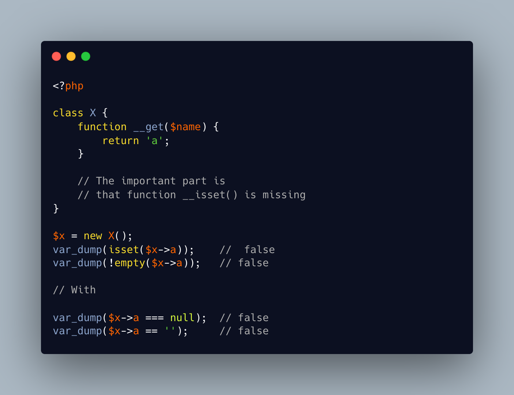

.. _not-set-but-exists:

Not Set But Exists
------------------

.. meta::
	:description:
		Not Set But Exists: In this code, a custom class X is created.
	:twitter:card: summary_large_image
	:twitter:site: @exakat
	:twitter:title: Not Set But Exists
	:twitter:description: Not Set But Exists: In this code, a custom class X is created
	:twitter:creator: @exakat
	:twitter:image:src: https://php-tips.readthedocs.io/en/latest/_images/not_set_but_exists.png
	:og:image: https://php-tips.readthedocs.io/en/latest/_images/not_set_but_exists.png
	:og:title: Not Set But Exists
	:og:type: article
	:og:description: In this code, a custom class X is created
	:og:url: https://php-tips.readthedocs.io/en/latest/tips/not_set_but_exists.html
	:og:locale: en

.. raw:: html

	

In this code, a custom class X is created. When checking the presence of a property ``a``, ``isset()`` and ``empty()`` both say ``false``. This is consistent with the definition of the class.

On the other hand, doing a comparison between the property and empty string, or ``null`` is also false: this looks paradoxical.

In fact, ``isset()`` and ``empty()`` both rely on the ``__isset()`` magic method. Since it is not created in the class, the default answer is ``false``. Yet, the ``__get()`` method exists, and returns a non-empty value, so when reaching for the property directly with ``$x->a``, a non-empty value is returned and compared to a falsy literal.

As a conclusion, it is important to provide ``__isset()``, alongside the ``__get()`` method to be consistent when an object of the class is used.

This bug may also bite any code that relies on the convention to compare properties by value, instead of checking existence as a separate attribute.

See Also
________

* `Not set but exists? <https://3v4l.org/WEI12>`_ [Try me]

PHP Features
____________

* `comparison <https://php-dictionary.readthedocs.io/en/latest/dictionary/comparison.ini.html>`_

* `isset <https://php-dictionary.readthedocs.io/en/latest/dictionary/isset.ini.html>`_

* `empty <https://php-dictionary.readthedocs.io/en/latest/dictionary/empty.ini.html>`_

* `__isset <https://php-dictionary.readthedocs.io/en/latest/dictionary/__isset.ini.html>`_

* `__get <https://php-dictionary.readthedocs.io/en/latest/dictionary/__get.ini.html>`_

* `existence <https://php-dictionary.readthedocs.io/en/latest/dictionary/existence.ini.html>`_

